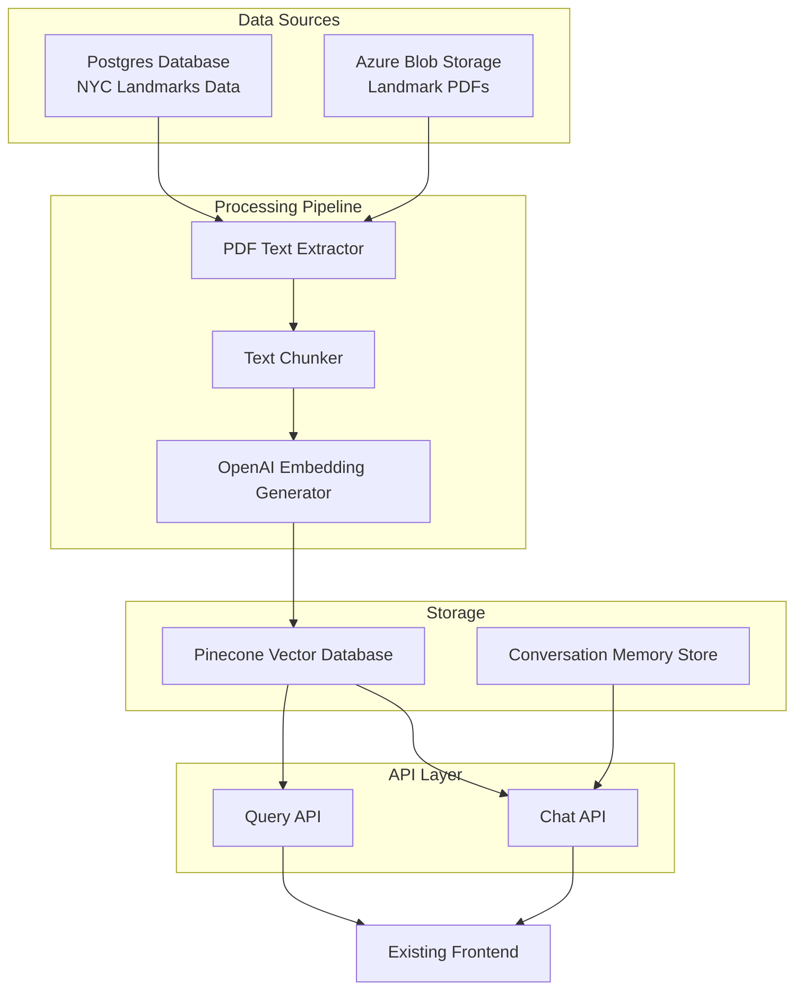

# NYC Landmarks Vector Database

A vector database system for NYC landmarks that extracts text from PDF reports, converts it to vector embeddings, and enables semantic search and chatbot functionality.

## Project Overview

This project aims to make information about New York City landmarks more accessible and searchable by:

1. Extracting text from PDF reports stored in Azure Blob Storage
2. Converting text into vector embeddings using OpenAI embedding models
3. Storing embeddings in a Pinecone vector database with appropriate metadata
4. Providing API endpoints for semantic search and chatbot functionality
5. Enabling filtering by landmark ID and other metadata

## System Architecture



## Features

- Extract text from PDF reports of NYC landmarks
- Process and chunk text for optimal embedding
- Generate embeddings using OpenAI's embedding models
- Store embeddings in Pinecone vector database with landmark metadata
- Provide vector search API for semantic queries
- Enable chatbot functionality with conversation memory
- Filter results by landmark ID and other metadata
- Integrate with existing PostgreSQL database and frontend applications

## Tech Stack

- **Python**: Primary programming language
- **OpenAI API**: For generating text embeddings
- **Pinecone**: Vector database for storing and searching embeddings
- **PostgreSQL**: Existing database containing NYC landmarks data
- **Azure Blob Storage**: Storage for landmark PDF reports
- **Google Cloud Secret Store**: For credential management
- **FastAPI**: For API endpoints
- **GitHub Actions**: For CI/CD

## Getting Started

### Prerequisites

- Python 3.9+
- Access to OpenAI API (API key)
- Access to Pinecone (API key)
- Access to Google Cloud Secret Store
- Access to Azure Blob Storage
- Access to PostgreSQL database

### Installation

```bash
# Clone the repository
git clone https://github.com/yourusername/nyc-landmarks-vector-db.git
cd nyc-landmarks-vector-db

# Install dependencies
pip install -r requirements.txt

# Set up environment variables or configure Google Cloud Secret Store
# (See documentation for details)

# Run the application
python -m nyc_landmarks.main
```

## Project Structure

```
nyc-landmarks-vector-db/
├── nyc_landmarks/               # Main package
│   ├── config/                  # Configuration management
│   ├── pdf/                     # PDF processing modules
│   ├── embeddings/              # Embedding generation and management
│   ├── vectordb/                # Vector database interactions
│   ├── api/                     # API endpoints
│   ├── chat/                    # Chat functionality
│   ├── db/                      # Database interactions
│   └── utils/                   # Utility functions
├── tests/                       # Test suite
├── docs/                        # Documentation
├── scripts/                     # Utility scripts
├── .github/                     # GitHub Actions workflows
├── memory-bank/                 # Project documentation
├── requirements.txt             # Dependencies
├── setup.py                     # Package setup
└── README.md                    # This file
```

## Documentation

Detailed documentation is available in the `memory-bank/` directory:

- `projectbrief.md`: Project overview and goals
- `productContext.md`: Product context and user experience
- `systemPatterns.md`: System architecture and design patterns
- `techContext.md`: Technical context and constraints
- `activeContext.md`: Current work focus and considerations
- `progress.md`: Project progress and status

## License

This project is licensed under the MIT License - see the LICENSE file for details.

## Acknowledgments

- NYC Landmarks Preservation Commission for the data
- OpenAI for the embedding models
- Pinecone for the vector database
