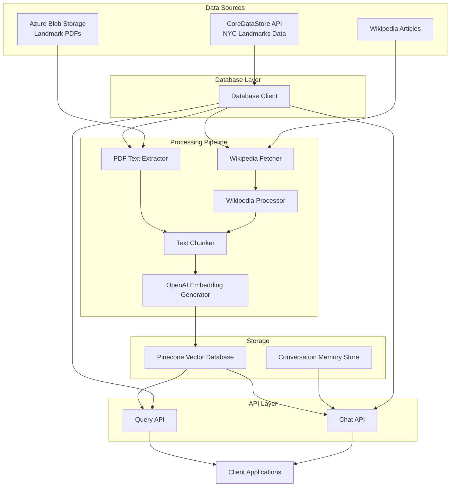

# NYC Landmarks Vector Database

[](https://github.com/stuartshay/nyc-landmarks-vector-db/actions/workflows/python-ci.yml)
[](https://github.com/stuartshay/nyc-landmarks-vector-db/actions/workflows/dependency-review.yml)

[](https://github.com/stuartshay/nyc-landmarks-vector-db/actions/workflows/process_landmarks.yml) [](https://github.com/stuartshay/nyc-landmarks-vector-db/actions/workflows/process_wikipedia.yml)

[](https://github.com/stuartshay/nyc-landmarks-vector-db/actions/workflows/deploy-gcp.yml)

```
Deployed Application
https://vector-db.coredatastore.com/docs
```

A vector database system for NYC landmarks that extracts metadata and text from API,
PDF reports and Wikipedia Pages, converts it to vector embeddings, and enables semantic search and chatbot
functionality.

## Project Overview

This project aims to make information about New York City landmarks more accessible and
searchable by:

1. Extracting text from PDF reports stored in Azure Blob Storage
1. Processing and chunking the text for optimal embedding
1. Converting text into vector embeddings using OpenAI embedding models
1. Storing embeddings in a Pinecone vector database with comprehensive metadata
1. Providing API endpoints for semantic search and chatbot functionality with
   conversation memory
1. Enabling filtering by landmark ID and other metadata
1. Integrating exclusively with the CoreDataStore API as the data source

The system makes previously inaccessible information in PDF reports easily searchable
through semantic understanding, allowing users to find relevant information about NYC
landmarks using natural language queries.

> **Note for Developers**: The API client now returns Pydantic models instead of
> dictionaries in some cases. See
> [API Response Handling Documentation](./docs/api_response_handling.md) for details on
> handling both response types.

## System Architecture



## Features

- **PDF Processing Pipeline**: Extract text from PDF reports of NYC landmarks using
  PyPDF2/PDFPlumber
- **Wikipedia Integration**: Fetch and process Wikipedia articles related to landmarks
  for additional content
- **Intelligent Text Chunking**: Process text into optimized chunks (500-1000 tokens)
  with 10-20% overlap for context preservation
- **High-Quality Embeddings**: Generate embeddings using OpenAI's text-embedding-3-small
  model (1536 dimensions)
- **Rich Metadata Storage**: Store embeddings in Pinecone with comprehensive metadata
  including landmark ID, source type (PDF/Wikipedia), chunk position, and more
- **Multi-Source Search**: Search across both PDF and Wikipedia content with source
  filtering capabilities
- **Semantic Search API**: Provide vector search API for natural language queries with
  relevant results
- **Conversational AI**: Enable chatbot functionality with conversation memory for
  contextual follow-up questions
- **Flexible Filtering**: Filter results by landmark ID, source type, borough,
  neighborhood, and other metadata
- **CoreDataStore Integration**: Access comprehensive NYC landmarks data exclusively
  through the CoreDataStore API
- **MCP Server Tools**: Leverage coredatastore-swagger-mcp server for direct API
  interactions with extended functionality
- **Secure Credential Management**: Manage all API keys and credentials through Google
  Cloud Secret Store

## Tech Stack

- **Python 3.12w3+**: Primary programming language
- **OpenAI API**: For generating text embeddings using text-embedding-3-small/large
  models
- **Pinecone**: Vector database for storing and searching embeddings with metadata
- **CoreDataStore API**: Exclusive REST API for accessing NYC landmarks information
- **coredatastore-swagger-mcp**: MCP server providing tools for CoreDataStore API
  interaction
- **Azure Blob Storage**: Storage location for landmark PDF reports
- **Google Cloud Secret Store**: For secure credential management across environments
- **FastAPI**: For creating API endpoints with automatic documentation
- **PyPDF2/PDFPlumber**: For extracting text from PDFs
- **Pydantic**: For data validation and settings management
- **Requests**: For making HTTP requests to CoreDataStore API
- **Pytest**: For testing framework
- **GitHub Actions**: For CI/CD pipeline

## Getting Started

### Prerequisites

- Python 3.13+
- Access to OpenAI API (API key)
- Access to Pinecone (API key)
- Access to Google Cloud Secret Store
- Access to Azure Blob Storage
- Access to CoreDataStore API (API key)
- Git

### Installation

```bash
# Clone the repository
git clone https://github.com/yourusername/nyc-landmarks-vector-db.git
cd nyc-landmarks-vector-db

# Option 1: Using venv (if you have Python 3.13 installed)
python3.13 -m venv venv

# Activate the virtual environment
# On Unix or MacOS:
source venv/bin/activate
# On Windows:
venv\Scripts\activate

# Option 2: Using Conda (recommended if Python 3.13 is not installed)
# Create a conda environment
conda create -n nyc-landmarks python=3.13

# Activate the conda environment
conda activate nyc-landmarks

# Install dependencies
pip install -r requirements.txt

# Set up environment variables
cp .env.example .env
# Edit .env with your preferred editor

# Run the application
python -m nyc_landmarks.main
```

## Development Setup

This project offers two ways to set up your development environment: using VS Code Dev
Containers (recommended) or a traditional local setup.

### Option 1: Using VS Code Dev Containers (Recommended)

This project includes a fully configured development container that provides a
consistent, isolated environment with all the necessary tools and dependencies
pre-installed.

#### Prerequisites

- [VS Code](https://code.visualstudio.com/)
- [Docker](https://www.docker.com/products/docker-desktop)
- [VS Code Remote - Containers extension](https://marketplace.visualstudio.com/items?itemName=ms-vscode-remote.remote-containers)

#### Steps

1. Clone the repository:

   ```bash
   git clone https://github.com/yourusername/nyc-landmarks-vector-db.git
   cd nyc-landmarks-vector-db
   ```

1. Open the project in VS Code:

   ```bash
   code .
   ```

1. When prompted to "Reopen in Container", click "Reopen in Container". Alternatively,
   you can:

   - Press F1 and select "Remote-Containers: Reopen in Container"
   - Click the green button in the bottom-left corner and select "Reopen in Container"

1. VS Code will build the container and configure the environment (this may take a few
   minutes the first time).

1. Once inside the container, you're ready to work on the project with all tools and
   dependencies pre-configured.

1. Copy the sample environment file and edit it:

   ```bash
   cp .env.example .env
   # Edit .env with your credentials
   ```

1. Set up the MCP server for CoreDataStore API interactions:

   ```bash
   # The coredatastore-swagger-mcp server should be configured
   # as specified in techContext.md
   ```

1. Run the application:

   ```bash
   python -m nyc_landmarks.main
   ```

1. **Configuration:**

   - Copy `.env.sample` to `.env` and add your API keys and configuration
   - Everything else is automatically set up by the devcontainer
   - **Google Cloud Platform**: GCP authentication is automatically configured using the service account key in `.gcp/service-account-key.json`. See [GCP Setup Documentation](./docs/gcp_setup.md) for details.

1. **Verify Setup:**

   Use VS Code tasks to verify your environment:

   - `Ctrl+Shift+P` → "Tasks: Run Task" → "Check Development Environment"
   - `Ctrl+Shift+P` → "Tasks: Run Task" → "Verify GCP Authentication"

## Development Environment Options

### Method 1: Using VS Code Development Container (Recommended)

The easiest way to set up the development environment is to use Visual Studio Code with
the Dev Containers extension, which automatically configures everything for you.

1. **Prerequisites:**

   - Install [Visual Studio Code](https://code.visualstudio.com/)
   - Install [Docker Desktop](https://www.docker.com/products/docker-desktop)
   - Install
     [VS Code Dev Containers extension](https://marketplace.visualstudio.com/items?itemName=ms-vscode-remote.remote-containers)

1. **Open in Container:**

   - Open VS Code
   - Use the command palette (`Ctrl+Shift+P` or `Cmd+Shift+P`) and select "Dev
     Containers: Open Folder in Container..."
   - Select the project repository folder
   - VS Code will build the container and install all dependencies automatically

1. **Configuration:**

   - Copy `.env.sample` to `.env` and add your API keys and configuration
   - Everything else is automatically set up by the devcontainer
   - **Google Cloud Platform**: GCP authentication is automatically configured using the service account key in `.gcp/service-account-key.json`. See [GCP Setup Documentation](./docs/gcp_setup.md) for details.

1. **Verify Setup:**

   Use VS Code tasks to verify your environment:

   - `Ctrl+Shift+P` → "Tasks: Run Task" → "Check Development Environment"
   - `Ctrl+Shift+P` → "Tasks: Run Task" → "Verify GCP Authentication"

### Method 2: Local Development Setup

If you prefer not to use containers, follow these steps to set up locally:

#### Prerequisites

- Python 3.13+
- Git

#### Steps

1. **Clone the repository:**

   ```bash
   git clone https://github.com/yourusername/nyc-landmarks-vector-db.git
   cd nyc-landmarks-vector-db
   ```

1. **Create and activate a virtual environment:**

   ```bash
   python3.13 -m venv venv

   # Activate the virtual environment
   # On Unix or MacOS:
   source venv/bin/activate
   # On Windows:
   venv\Scripts\activate
   ```

1. **Install dependencies:**

   ```bash
   # Install regular dependencies
   pip install -r requirements.txt

   # Install development dependencies
   pip install -e ".[dev]"
   ```

1. **Set up pre-commit hooks:**

   ```bash
   pip install pre-commit
   pre-commit install
   pre-commit run --all-files  # Optional
   ```

1. **Configure environment variables:**

   ```bash
   cp .env.sample .env
   # Edit .env with your credentials
   ```

1. **Configure MCP server for CoreDataStore API:**

   ```bash
   # Set up the coredatastore-swagger-mcp server
   # as detailed in techContext.md
   ```

1. **Run the application:**

   ```bash
   python -m nyc_landmarks.main
   ```

## Dependency Management

This project uses a dual approach to dependency management:

- **setup.py**: Defines package metadata and flexible dependencies with minimum version
  constraints (`>=`)
- **requirements.txt**: Contains pinned, exact versions for reproducible environments

### Installing Dependencies

For development:

There are two ways to set up your development environment:

**Option A: Using the automated setup script (recommended for notebook users)**

```bash
# Make the script executable
chmod +x ./setup_env.sh

# Set up the environment using the setup script
./setup_env.sh

# The script will create a virtual environment, install all dependencies,
# and set up pre-commit hooks automatically
```

**Option B: Manual setup**

```bash
# Create a virtual environment
python -m venv venv

# Activate the virtual environment
source venv/bin/activate

# Install the package in development mode with all dev dependencies
pip install -e ".[dev]"

# Set up pre-commit hooks
pre-commit install
```

### Keeping Dependencies in Sync

We use automated tools to keep `setup.py` and `requirements.txt` in sync:

1. **Automated Sync**: Our GitHub workflow automatically syncs versions between files
   when Dependabot creates updates
1. **Manual Sync**: Run `./scripts/ci/sync_versions.sh` to manually sync versions between files
1. **Generating requirements.txt**: Generate requirements.txt from setup.py using
   pip-compile:
   ```bash
   pip-compile --constraint=constraints.txt --output-file=requirements.txt
   ```

### Adding New Dependencies

To add a new dependency:

1. Add it to `setup.py` with an appropriate version constraint
1. Regenerate `requirements.txt` using pip-compile
1. Commit both files together

## Package Management

This project uses a dual dependency management approach to balance flexibility with
reproducibility:

### Dependency Files

- **setup.py**: Contains package metadata and flexible dependencies with minimum
  versions (`>=`)
- **requirements.txt**: Contains exact pinned versions (`==`) for reproducible
  environments

### Adding New Dependencies

1. First add the dependency to `setup.py` with appropriate version constraints:

   ```python
   install_requires = (
       [
           # ...existing dependencies...
           "new-package>=1.0.0",  # Add new package here
       ],
   )
   ```

1. Then generate the updated `requirements.txt`:

   ```bash
   pip-compile --constraint=constraints.txt --output-file=requirements.txt
   ```

1. Commit both files together.

### Synchronizing Versions

We provide a script to keep `setup.py` and `requirements.txt` in sync:

```bash
# Make the script executable if needed
chmod +x scripts/ci/sync_versions.sh

# Run the synchronization
./scripts/ci/sync_versions.sh
```

### Updating Pinecone SDK

This project requires Pinecone SDK v6.0.2 or later. To update the Pinecone SDK:

```bash
./manage_packages.sh pinecone
```

### Dependency Updates

- Dependabot automatically checks for updates and security vulnerabilities
- When Dependabot creates PRs, our GitHub workflow syncs versions between files
- Always test thoroughly after dependency updates

#### Google Cloud CLI Setup in Dev Container

The development container comes with the Google Cloud CLI pre-installed. To use it for
accessing secrets:

1. **Authenticate with Google Cloud:**

   ```bash
   gcloud auth login
   ```

   This will open a browser window where you can log in with your Google account.

1. **Set your Google Cloud project:**

   ```bash
   gcloud config set project your-project-id
   ```

   Replace `your-project-id` with your actual Google Cloud project ID.

1. **Set up Application Default Credentials:**

   ```bash
   gcloud auth application-default login
   ```

   This will set up credentials for your local development environment.

1. **Access Google Cloud Secret Manager:**

   ```bash
   # List available secrets
   gcloud secrets list

   # Access a specific secret
   gcloud secrets versions access latest --secret="your-secret-name"
   ```

1. **Configure service account (if needed):**

   ```bash
   gcloud iam service-accounts keys create key-file.json --iam-account=your-service-account@your-project.iam.gserviceaccount.com
   export GOOGLE_APPLICATION_CREDENTIALS="$PWD/key-file.json"
   ```

The Google Cloud CLI provides many more capabilities. For more details, run
`gcloud --help` or visit the
[Google Cloud CLI documentation](https://cloud.google.com/sdk/gcloud/reference).

### Option 2: Traditional Local Setup

If you prefer to set up the development environment locally without containers:

#### Prerequisites

- Python 3.11+
- Git

#### Steps

1. **Clone the repository:**

   ```bash
   git clone https://github.com/yourusername/nyc-landmarks-vector-db.git
   cd nyc-landmarks-vector-db
   ```

1. **Create and activate a virtual environment:**

   ```bash
   python3.12 -m venv venv

   # Activate the virtual environment
   # On Unix or MacOS:
   source venv/bin/activate
   # On Windows:
   venv\Scripts\activate
   ```

1. **Install dependencies:**

   ```bash
   # Install regular dependencies
   pip install -r requirements.txt

   # Install development dependencies
   pip install -e ".[dev]"
   ```

1. **Set up pre-commit hooks:**

   ```bash
   pip install pre-commit
   pre-commit install
   pre-commit run --all-files  # Optional
   ```

1. **Configure environment variables:**

   ```bash
   cp .env.sample .env
   # Edit .env with your credentials
   ```

1. **Configure MCP server for CoreDataStore API:**

   ```bash
   # Set up the coredatastore-swagger-mcp server
   # as detailed in techContext.md
   ```

1. **Run the application:**

   ```bash
   python -m nyc_landmarks.main
   ```

## Code Quality Standards

This project enforces:

- Static type checking with mypy (strict mode)
- Code formatting with Black (88 character line length)
- Import sorting with isort
- Linting with flake8 and pylint
- Minimum 80% test coverage
- Security scanning with bandit

See [CONTRIBUTING.md](CONTRIBUTING.md) for detailed information on our development
workflow and code standards.

## Package Management

The project includes a comprehensive script for managing Python dependencies:

```bash
# Update all packages to their latest versions
./manage_packages.sh update

# Sync versions between requirements.txt and setup.py
./manage_packages.sh sync

# Update Pinecone SDK specifically
./manage_packages.sh pinecone

# Check for outdated packages
./manage_packages.sh check

# Show help information
./manage_packages.sh help
```

This script ensures consistent package versions between `setup.py` and
`requirements.txt` and simplifies dependency updates.

## VS Code Integration

This project includes Visual Studio Code configuration for an optimal development
experience:

**Features enabled:**

- Integrated linting and type checking
- Auto-formatting on save
- Debug configurations for various project components
- Test runner integration
- Consistency via EditorConfig

To take full advantage of these features, install the recommended extensions when
prompted by VS Code.

## SonarQube Code Quality

This repository includes a Docker Compose file for running a local
SonarQube Community Edition instance. Start the stack with:

```bash
docker compose -f docker-compose.sonarqube.yml up -d
```

See [SonarQube Setup](./docs/sonarqube_setup.md) for details on
testing and shutting down the container.

## Project Structure

```
nyc-landmarks-vector-db/
├── nyc_landmarks/                # Main package
│   ├── api/                      # API endpoints for vector search and chat
│   │   ├── __init__.py
│   │   ├── chat.py               # Chat API with conversation memory
│   │   └── query.py              # Vector search API endpoints
│   ├── chat/                     # Chat functionality
│   │   ├── __init__.py
│   │   └── conversation.py       # Conversation memory implementation
│   ├── config/                   # Configuration management
│   │   ├── __init__.py
│   │   └── settings.py           # Settings with Google Cloud Secret integration
│   ├── db/                       # Database interactions
│   │   ├── __init__.py
│   │   ├── db_client.py          # Database client interface
│   │   ├── postgres.py           # Low-level database operations
│   │   └── coredatastore_api.py  # CoreDataStore API client implementation
│   ├── embeddings/               # Embedding generation and management
│   │   ├── __init__.py
│   │   └── generator.py          # OpenAI embedding generator
│   ├── pdf/                      # PDF processing modules
│   │   ├── __init__.py
│   │   ├── extractor.py          # PDF text extraction
│   │   └── text_chunker.py       # Text chunking with overlap
│   ├── utils/                    # Utility functions
│   │   ├── __init__.py
│   │   └── logger.py             # Logging configuration
│   ├── vectordb/                 # Vector database interactions
│   │   ├── __init__.py
│   │   ├── pinecone_db.py        # Pinecone interactions
│   │   └── enhanced_metadata.py  # Enhanced metadata handling
│   ├── __init__.py
│   ├── main.py                   # Application entry point
│   └── py.typed                  # Marker file for type checking
├── tests/                        # Test suite
├── docs/                         # Documentation
├── scripts/                      # Utility scripts
│   ├── fetch_landmark_reports.py # Fetch reports from CoreDataStore API
│   ├── process_landmark_pdfs.py  # Process PDFs into embeddings
│   ├── process_landmarks.py      # Process landmark data
│   └── demo.py                   # Demo script
├── sample_pdfs/                  # Sample PDFs for testing
├── .github/                      # GitHub Actions workflows
├── memory-bank/                  # Project documentation and institutional knowledge
│   ├── README.md                 # Guide for using the memory bank
│   ├── test-improvements.md      # Record of test infrastructure improvements
│   ├── ci_cd_pipeline.md         # CI/CD documentation
│   ├── research_items.md         # Research findings and decisions
│   └── ...                       # Other project documentation
├── requirements.txt              # Dependencies
├── setup.py                      # Package setup
└── README.md                     # This file
```

## Configuration

The project uses the CoreDataStore API as the exclusive data source for NYC landmarks
information. The API provides comprehensive access to landmark data, buildings, photos,
PLUTO data, and more. The system is designed with a secure configuration approach:

### Production Environment

- All credentials are stored in Google Cloud Secret Store
- The application retrieves secrets at runtime
- No credentials are stored in code or environment variables

### Development Environment

- Credentials can be stored in a local `.env` file
- The application will fall back to environment variables if Google Cloud is not
  configured
- Sample configurations are provided in `.env.example`

### Key Configuration Parameters

- `COREDATASTORE_API_KEY`: Your API key for accessing the CoreDataStore API
- `OPENAI_API_KEY`: Your API key for OpenAI's embedding models
- `PINECONE_API_KEY`: Your API key for the Pinecone vector database
- `PINECONE_ENVIRONMENT`: The Pinecone environment to use
- `PINECONE_INDEX_NAME`: The name of your Pinecone index
- `GOOGLE_CLOUD_PROJECT`: Google Cloud project ID for Secret Store
- `TEXT_CHUNK_SIZE`: Size of text chunks for embedding (tokens)
- `TEXT_CHUNK_OVERLAP`: Overlap between chunks (percentage)
- `EMBEDDING_MODEL`: OpenAI embedding model to use
- `EMBEDDING_DIMENSION`: Dimension of the embeddings

## Documentation

Detailed documentation is available in the `memory-bank/` directory:

- `projectbrief.md`: Project overview and requirements
- `productContext.md`: Product context and user experience goals
- `systemPatterns.md`: System architecture and design patterns
- `techContext.md`: Technical context and constraints
- `activeContext.md`: Current work focus and considerations
- `progress.md`: Project progress and status

## License

This project is licensed under the MIT License - see the LICENSE file for details.

## Acknowledgments

- NYC Landmarks Preservation Commission for the data
- CoreDataStore for the API access
- OpenAI for the embedding models
- Pinecone for the vector database
