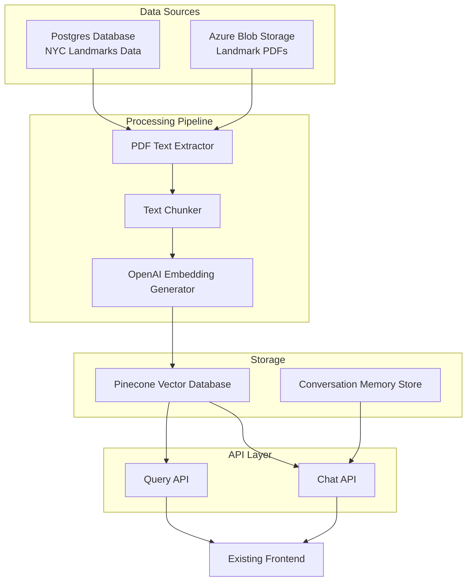

# NYC Landmarks Vector Database

A vector database system for NYC landmarks that extracts text from PDF reports, converts it to vector embeddings, and enables semantic search and chatbot functionality.

## Project Overview

This project aims to make information about New York City landmarks more accessible and searchable by:

1. Extracting text from PDF reports stored in Azure Blob Storage
2. Converting text into vector embeddings using OpenAI embedding models
3. Storing embeddings in a Pinecone vector database with appropriate metadata
4. Providing API endpoints for semantic search and chatbot functionality
5. Enabling filtering by landmark ID and other metadata

## System Architecture



## Features

- Extract text from PDF reports of NYC landmarks
- Process and chunk text for optimal embedding
- Generate embeddings using OpenAI's embedding models
- Store embeddings in Pinecone vector database with landmark metadata
- Provide vector search API for semantic queries
- Enable chatbot functionality with conversation memory
- Filter results by landmark ID and other metadata
- Integrate with existing PostgreSQL database and frontend applications

## Tech Stack

- **Python**: Primary programming language
- **OpenAI API**: For generating text embeddings
- **Pinecone**: Vector database for storing and searching embeddings
- **PostgreSQL**: Existing database containing NYC landmarks data
- **Azure Blob Storage**: Storage for landmark PDF reports
- **Google Cloud Secret Store**: For credential management
- **FastAPI**: For API endpoints
- **GitHub Actions**: For CI/CD

## Getting Started

### Prerequisites

- Python 3.11+
- Access to OpenAI API (API key)
- Access to Pinecone (API key)
- Access to Google Cloud Secret Store
- Access to Azure Blob Storage
- Access to PostgreSQL database
- Git

### Installation

```bash
# Clone the repository
git clone https://github.com/yourusername/nyc-landmarks-vector-db.git
cd nyc-landmarks-vector-db

# Create a virtual environment
python3.11 -m venv venv

# Activate the virtual environment
# On Unix or MacOS:
source venv/bin/activate
# On Windows:
venv\Scripts\activate

# Install dependencies
pip install -r requirements.txt

# Set up environment variables or configure Google Cloud Secret Store
cp .env.sample .env
# Edit .env with your preferred editor

# Run the application
python -m nyc_landmarks.main
```

## Development Setup

This project offers two ways to set up your development environment: using VS Code Dev Containers (recommended) or a traditional local setup.

### Option 1: Using VS Code Dev Containers (Recommended)

This project includes a fully configured development container that provides a consistent, isolated environment with all the necessary tools and dependencies pre-installed.

#### Prerequisites
- [VS Code](https://code.visualstudio.com/)
- [Docker](https://www.docker.com/products/docker-desktop)
- [VS Code Remote - Containers extension](https://marketplace.visualstudio.com/items?itemName=ms-vscode-remote.remote-containers)

#### Steps
1. Clone the repository:
   ```bash
   git clone https://github.com/yourusername/nyc-landmarks-vector-db.git
   cd nyc-landmarks-vector-db
   ```

2. Open the project in VS Code:
   ```bash
   code .
   ```

3. When prompted to "Reopen in Container", click "Reopen in Container". Alternatively, you can:
   - Press F1 and select "Remote-Containers: Reopen in Container"
   - Click the green button in the bottom-left corner and select "Reopen in Container"

4. VS Code will build the container and configure the environment (this may take a few minutes the first time).

5. Once inside the container, you're ready to work on the project with all tools and dependencies pre-configured.

6. Copy the sample environment file and edit it:
   ```bash
   cp .env.sample .env
   # Edit .env with your credentials
   ```

7. Run the application:
   ```bash
   python -m nyc_landmarks.main
   ```

#### Google Cloud CLI Setup in Dev Container

The development container comes with the Google Cloud CLI pre-installed. To use it:

1. **Authenticate with Google Cloud:**
   ```bash
   gcloud auth login
   ```
   This will open a browser window where you can log in with your Google account.

2. **Set your Google Cloud project:**
   ```bash
   gcloud config set project your-project-id
   ```
   Replace `your-project-id` with your actual Google Cloud project ID.

3. **Set up Application Default Credentials:**
   ```bash
   gcloud auth application-default login
   ```
   This will set up credentials for your local development environment.

4. **Access Google Cloud Secret Manager:**
   ```bash
   # List available secrets
   gcloud secrets list

   # Access a specific secret
   gcloud secrets versions access latest --secret="your-secret-name"
   ```

5. **Configure service account (if needed):**
   ```bash
   gcloud iam service-accounts keys create key-file.json --iam-account=your-service-account@your-project.iam.gserviceaccount.com
   export GOOGLE_APPLICATION_CREDENTIALS="$PWD/key-file.json"
   ```

The Google Cloud CLI provides many more capabilities. For more details, run `gcloud --help` or visit the [Google Cloud CLI documentation](https://cloud.google.com/sdk/gcloud/reference).

### Option 2: Traditional Local Setup

If you prefer to set up the development environment locally without containers:

#### Prerequisites
- Python 3.11+
- Git

#### Steps

1. **Clone the repository:**
   ```bash
   git clone https://github.com/yourusername/nyc-landmarks-vector-db.git
   cd nyc-landmarks-vector-db
   ```

2. **Create and activate a virtual environment:**
   ```bash
   python3.11 -m venv venv

   # Activate the virtual environment
   # On Unix or MacOS:
   source venv/bin/activate
   # On Windows:
   venv\Scripts\activate
   ```

3. **Install dependencies:**
   ```bash
   # Install regular dependencies
   pip install -r requirements.txt

   # Install development dependencies
   pip install -e ".[dev]"
   ```

4. **Set up pre-commit hooks:**
   ```bash
   pip install pre-commit
   pre-commit install
   pre-commit run --all-files  # Optional
   ```

5. **Configure environment variables:**
   ```bash
   cp .env.sample .env
   # Edit .env with your credentials
   ```

6. **Run the application:**
   ```bash
   python -m nyc_landmarks.main
   ```

## Code Quality Standards

This project enforces:
- Static type checking with mypy (strict mode)
- Code formatting with Black (88 character line length)
- Import sorting with isort
- Linting with flake8 and pylint
- Minimum 80% test coverage
- Security scanning with bandit

See [CONTRIBUTING.md](CONTRIBUTING.md) for detailed information on our development workflow and code standards.

## VS Code Integration

This project includes Visual Studio Code configuration for an optimal development experience:

**Features enabled:**
- Integrated linting and type checking
- Auto-formatting on save
- Debug configurations for various project components
- Test runner integration
- Consistency via EditorConfig

To take full advantage of these features, install the recommended extensions when prompted by VS Code.

## Project Structure

```
nyc-landmarks-vector-db/
├── nyc_landmarks/               # Main package
│   ├── config/                  # Configuration management
│   ├── pdf/                     # PDF processing modules
│   ├── embeddings/              # Embedding generation and management
│   ├── vectordb/                # Vector database interactions
│   ├── api/                     # API endpoints
│   ├── chat/                    # Chat functionality
│   ├── db/                      # Database interactions
│   └── utils/                   # Utility functions
├── tests/                       # Test suite
├── docs/                        # Documentation
├── scripts/                     # Utility scripts
├── .github/                     # GitHub Actions workflows
├── memory-bank/                 # Project documentation
├── requirements.txt             # Dependencies
├── setup.py                     # Package setup
└── README.md                    # This file
```

## Documentation

Detailed documentation is available in the `memory-bank/` directory:

- `projectbrief.md`: Project overview and goals
- `productContext.md`: Product context and user experience
- `systemPatterns.md`: System architecture and design patterns
- `techContext.md`: Technical context and constraints
- `activeContext.md`: Current work focus and considerations
- `progress.md`: Project progress and status

## License

This project is licensed under the MIT License - see the LICENSE file for details.

## Acknowledgments

- NYC Landmarks Preservation Commission for the data
- OpenAI for the embedding models
- Pinecone for the vector database
