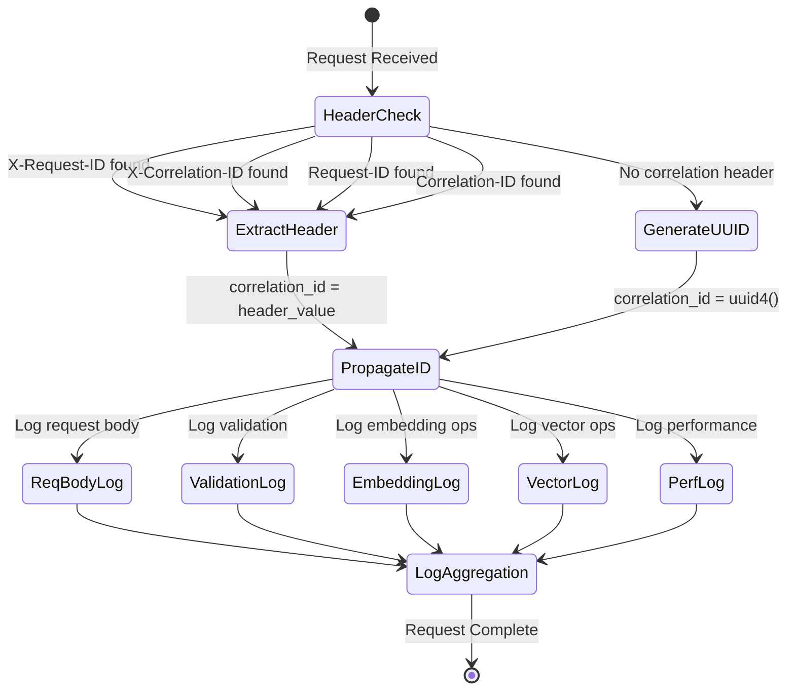

# API Query Search Sequence Diagram

## Mermaid Sequence Diagram

This diagram shows the complete flow of logging for a POST request to `/api/query/search` with correlation ID propagation.


## Log Aggregation Flow

```mermaid
graph TD
    A[Incoming Request] --> B{Has Correlation ID Header?}
    B -->|Yes| C[Extract from Header]
    B -->|No| D[Generate UUID4]
    C --> E[correlation_id = header_value]
    D --> E

    E --> F[Request Body Middleware]
    F --> G[Performance Middleware]
    G --> H[API Endpoint]
    H --> I[Validation Logger]
    H --> J[Embedding Generator]
    H --> K[Vector Database]

    F --> L[Log Entry 1]
    I --> M[Log Entry 2]
    I --> N[Log Entry 3]
    J --> O[Log Entry 4]
    J --> P[Log Entry 5]
    K --> Q[Log Entry 6]
    K --> R[Log Entry 7]
    G --> S[Log Entry 8]

    L --> T[All logs contain same correlation_id]
    M --> T
    N --> T
    O --> T
    P --> T
    Q --> T
    R --> T
    S --> T

    T --> U[Log Aggregation Query]
    U --> V[grep correlation_id logs/*.log]
    U --> W[jq '.correlation_id == "abc-123"' logs/*.json]
```

## Component Interaction Overview


## Correlation ID Lifecycle



## Key Logging Points Summary

| Step | Component       | Log Message                        | Correlation ID |
| ---- | --------------- | ---------------------------------- | -------------- |
| 1    | Request Body MW | "POST request body logged"         | ✅             |
| 2    | Validation      | "Valid API request processed"      | ✅             |
| 3    | Query API       | "Generating embedding for query"   | ✅             |
| 4    | Query API       | "Embedding generation completed"   | ✅             |
| 5    | Vector DB       | "Starting vector query operation"  | ✅             |
| 6    | Vector DB       | "Vector query operation completed" | ✅             |
| 7    | Performance MW  | "API request completed"            | ✅             |

All log entries contain the same correlation ID, enabling complete request tracing and log aggregation.
