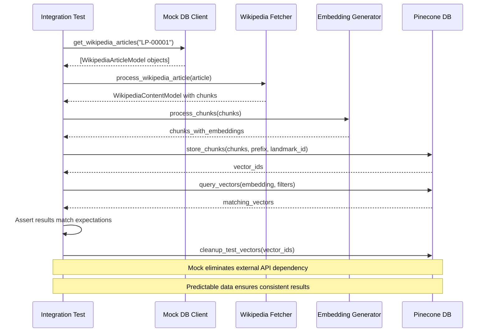
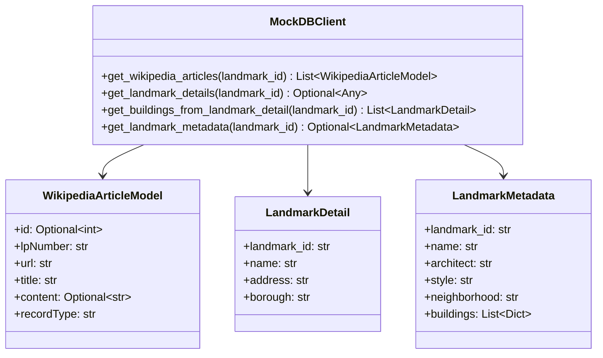
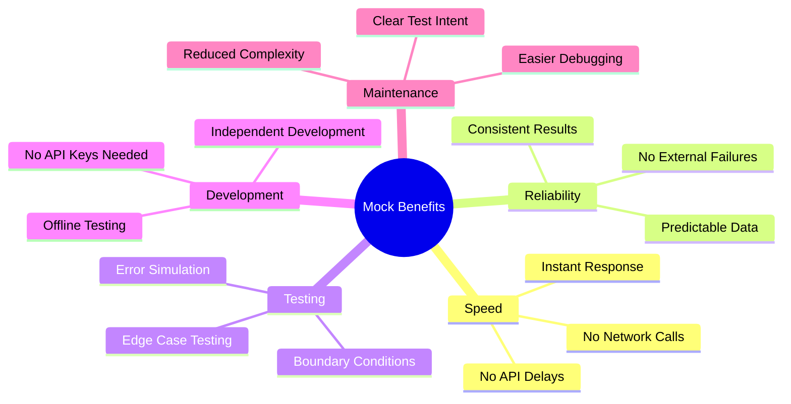
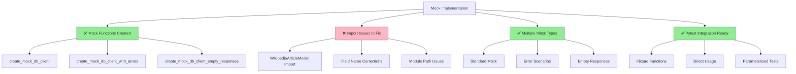

# Mock Architecture Flow Documentation

## Overview

This document illustrates the mock architecture used in the NYC Landmarks Vector DB project to replace external dependencies during testing.

## Mock Flow Architecture

```mermaid
graph TD
    A[Integration Test] --> B{Use Mock?}
    B -->|Yes| C[create_mock_db_client()]
    B -->|No| D[Real db_client]

    C --> E[Mock DB Client]
    D --> F[Real CoreDataStore API]

    E --> G[Mock Wikipedia Articles]
    E --> H[Mock Landmark Details]
    E --> I[Mock Buildings Data]
    E --> J[Mock Metadata]

    F --> K[External API Calls]
    F --> L[Network Dependencies]
    F --> M[Timeout Risks]

    G --> N[Predictable Test Data]
    H --> N
    I --> N
    J --> N

    K --> O[Variable Results]
    L --> P[Test Instability]
    M --> P

    N --> Q[Fast, Reliable Tests]
    O --> R[Slow, Flaky Tests]
    P --> R

    style C fill:#90EE90
    style E fill:#90EE90
    style G fill:#90EE90
    style H fill:#90EE90
    style I fill:#90EE90
    style J fill:#90EE90
    style N fill:#90EE90
    style Q fill:#90EE90

    style D fill:#FFB6C1
    style F fill:#FFB6C1
    style K fill:#FFB6C1
    style L fill:#FFB6C1
    style M fill:#FFB6C1
    style O fill:#FFB6C1
    style P fill:#FFB6C1
    style R fill:#FFB6C1
```

## Mock Types and Use Cases

```mermaid
graph LR
    A[Mock Types] --> B[Standard Mock]
    A --> C[Error Mock]
    A --> D[Empty Response Mock]

    B --> B1[create_mock_db_client()]
    B --> B2[Normal Test Scenarios]
    B --> B3[Happy Path Testing]

    C --> C1[create_mock_db_client_with_errors()]
    C --> C2[Connection Errors]
    C --> C3[Timeout Scenarios]
    C --> C4[Invalid Data]

    D --> D1[create_mock_db_client_empty_responses()]
    D --> D2[No Data Found]
    D --> D3[Edge Cases]
    D --> D4[Boundary Testing]

    style B fill:#87CEEB
    style C fill:#FFA07A
    style D fill:#DDA0DD
```

## Wikipedia Integration Test Flow with Mocks



## Mock Data Structure



## Benefits of Mock Architecture



## Current Mock Implementation Status



## Next Steps for Mock Implementation

1. **Fix Import Issues**: Resolve WikipediaArticleModel import path
1. **Validate Field Names**: Ensure mock data matches actual model requirements
1. **Test Mock Integration**: Run tests with mocks to verify functionality
1. **Expand Mock Coverage**: Add more landmark IDs and scenarios
1. **Document Usage**: Create examples for different mock types

## Usage Examples

### Standard Mock Usage

```python
from tests.mocks import create_mock_db_client


def test_wikipedia_processing():
    mock_client = create_mock_db_client()
    articles = mock_client.get_wikipedia_articles("LP-00001")
    assert len(articles) > 0
```

### Error Testing

```python
from tests.mocks import create_mock_db_client_with_errors


def test_api_error_handling():
    mock_client = create_mock_db_client_with_errors()
    with pytest.raises(ConnectionError):
        mock_client.get_wikipedia_articles("LP-00001")
```

### Empty Response Testing

```python
from tests.mocks import create_mock_db_client_empty_responses


def test_no_data_scenario():
    mock_client = create_mock_db_client_empty_responses()
    articles = mock_client.get_wikipedia_articles("LP-99999")
    assert len(articles) == 0
```
