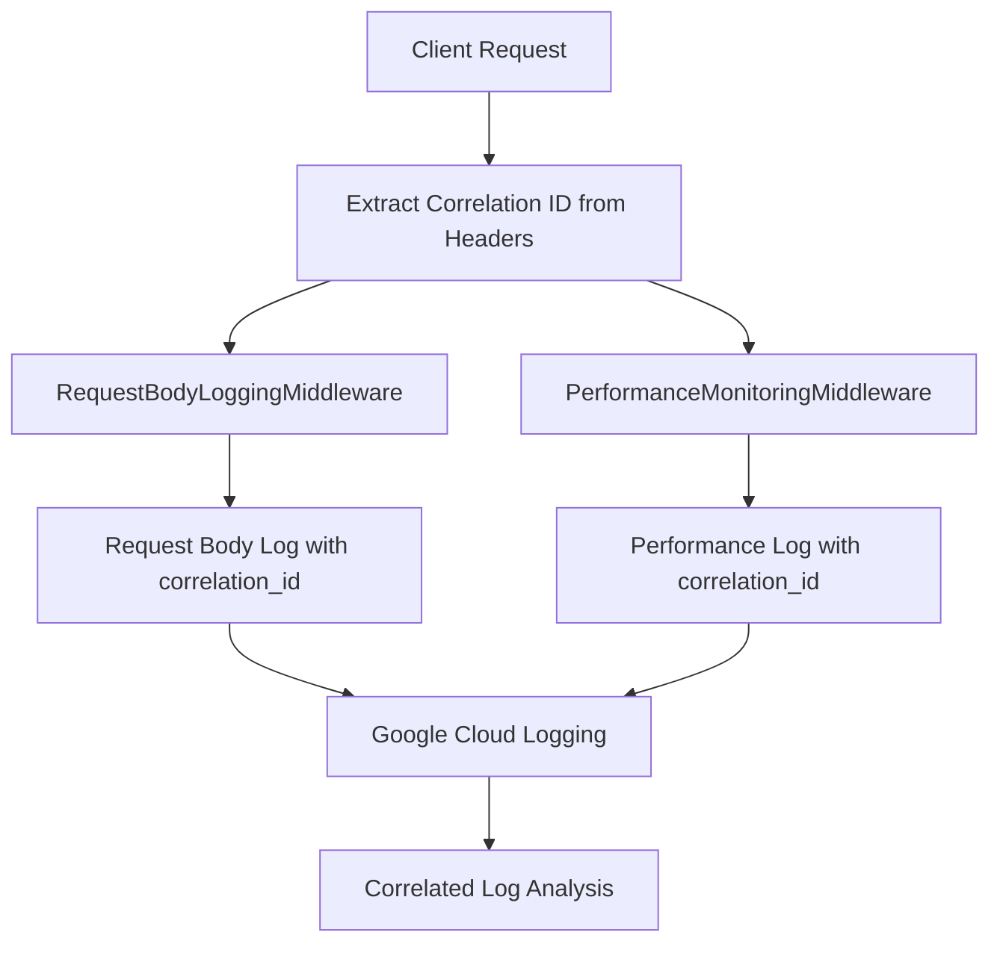

# PR #209 Correlation Enhancement Summary

## 🎯 What We Accomplished

### ✅ Addressed Copilot Review Comments

- **Fixed redundant correlation_id entries** in request body logging middleware
- Removed duplicate correlation_id fields from log statements
- Ensured single source of truth via `_get_client_info()` function

### ✅ Implemented Header-Based Correlation IDs

- **Multi-header support**: X-Request-ID, X-Correlation-ID, Request-ID, Correlation-ID
- **Priority order**: X-Request-ID has highest priority, others follow hierarchy
- **UUID fallback**: Auto-generates correlation IDs when headers aren't provided

### ✅ Enhanced Performance Monitoring Middleware

- Added `_get_correlation_id()` function to extract correlation IDs from headers
- Enhanced `PerformanceMonitoringMiddleware.dispatch()` with correlation tracking
- Now performance logs include correlation_id field for cross-middleware correlation

### ✅ Comprehensive Testing Framework

- Created `test_correlation_headers.py` with multiple test scenarios
- Tests all header formats, priority order, session correlation, and end-to-end tracking
- Provides Google Cloud Logging query examples for log analysis

### ✅ Complete Documentation

- Created `correlation_id_headers.md` with usage examples and best practices
- Includes curl examples, query patterns, and implementation details
- Covers session tracking and microservice propagation patterns

## 🔗 End-to-End Correlation Flow



## 🚀 Key Benefits

1. **Full Request Traceability**: Track requests across both middleware layers
1. **Session Correlation**: Group related requests using same correlation ID
1. **Flexible Header Support**: Works with various header naming conventions
1. **Automated Fallback**: Never lose correlation - auto-generates UUIDs when needed
1. **GCP Integration**: Native Google Cloud Logging correlation queries

## 🧪 Testing Results

All tests passing! ✅

- **Header Format Tests**: X-Request-ID, X-Correlation-ID, Request-ID, Correlation-ID
- **Priority Tests**: X-Request-ID takes precedence over other headers
- **Session Tests**: Multiple requests tracked under same correlation ID
- **End-to-End Tests**: Request body and performance logs properly correlated

## 📊 Log Correlation Examples

### Request Body Log

```json
{
  "correlation_id": "user-session-123",
  "metric_type": "request_body",
  "endpoint": "/api/query/search",
  "request_body": {"query": "Brooklyn Bridge"},
  "body_size_bytes": 34
}
```

### Performance Log

```json
{
  "correlation_id": "user-session-123",
  "metric_type": "performance",
  "endpoint": "POST /api/query/search",
  "response_time_ms": 1850.23,
  "status_code": 200
}
```

### Correlation Query

```bash
jsonPayload.correlation_id="user-session-123"
```

## 🎉 Ready for Production

The correlation system is fully implemented and tested. Users can now:

1. **Send correlation IDs in request headers** using multiple formats
1. **Track request flow** across all middleware layers
1. **Analyze session behavior** with grouped correlation queries
1. **Debug issues** with end-to-end request tracing

All PR review comments have been addressed and the correlation enhancement is complete! 🚀
