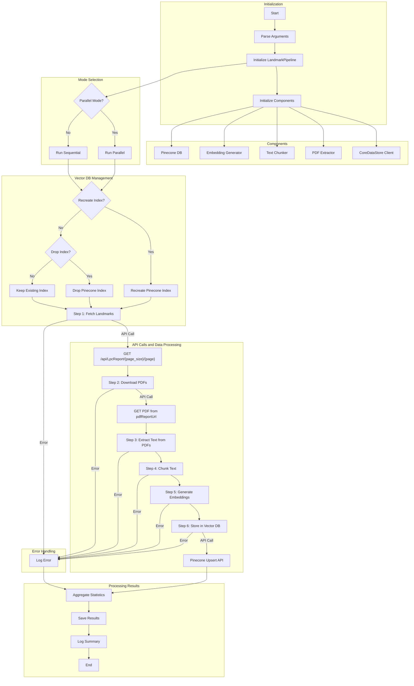

# NYC Landmarks Vector Database - API Documentation

This document provides comprehensive documentation of the process_landmarks GitHub Action workflow and the CoreDataStore API schema used in the NYC Landmarks Vector Database project.

## Process Landmarks Pipeline

The process_landmarks script implements a complete pipeline for processing NYC landmark data, fetching it from the CoreDataStore API, extracting text from PDFs, generating embeddings, and storing them in Pinecone vector database.

### Pipeline Workflow Diagram



### Pipeline Steps

1. **Initialization**: Set up the pipeline and initialize all required components.
2. **API Step 1 - Fetch Landmarks**: Retrieve landmarks from the CoreDataStore API using pagination.
3. **API Step 2 - Download PDFs**: Download PDF reports for each landmark using the URLs provided in the API response.
4. **Processing Step 3 - Extract Text**: Extract text content from the downloaded PDFs.
5. **Processing Step 4 - Chunk Text**: Split the extracted text into smaller chunks for embedding generation.
6. **Processing Step 5 - Generate Embeddings**: Generate vector embeddings for each text chunk.
7. **API Step 6 - Store in Vector DB**: Store the embeddings in Pinecone vector database with enhanced metadata.
8. **Finalization**: Aggregate statistics and save results to files.

Each step includes robust error handling and logging to ensure the pipeline can recover from failures and provide clear information about the processing status.

## CoreDataStore API Schema

The NYC Landmarks Vector Database interacts with the CoreDataStore API to retrieve landmark data. Below is the documentation for the key endpoints used in the pipeline.

### 1. Landmark Reports API

#### GET `/api/LpcReport/{pageSize}/{page}`
Retrieves a paginated list of landmark reports.

**Parameters:**
- `pageSize` (path): Number of results per page (default: 100)
- `page` (path): Page number, starting from 1
- `SearchText` (query, optional): Filter results by search term
- `Borough` (query, optional): Filter by borough
- `ObjectType` (query, optional): Filter by object type
- `Neighborhood` (query, optional): Filter by neighborhood
- `ParentStyleList` (query, optional): Filter by architectural style
- `SortColumn` (query, optional): Column to sort by
- `SortOrder` (query, optional): Sort direction ("asc" or "desc")

**Response Schema:**
```json
{
  "results": [
    {
      "lpNumber": "LP-00001",
      "name": "Example Landmark",
      "street": "123 Example Street",
      "borough": "Manhattan",
      "objectType": "Individual Landmark",
      "dateDesignated": "1965-10-14",
      "architect": "Example Architect",
      "style": "Example Style",
      "neighborhood": "Example Neighborhood",
      "pdfReportUrl": "https://example.com/pdf/LP-00001.pdf",
      "photoUrl": "https://example.com/photos/LP-00001.jpg"
    }
  ],
  "totalResults": 100,
  "currentPage": 1,
  "pageCount": 10,
  "pageSize": 10
}
```

#### GET `/api/LpcReport/{landmark_id}`
Retrieves detailed information about a specific landmark.

**Parameters:**
- `landmark_id` (path): The LP number of the landmark (e.g., "LP-00001")

**Response Schema:**
```json
{
  "lpNumber": "LP-00001",
  "name": "Example Landmark",
  "street": "123 Example Street",
  "borough": "Manhattan",
  "objectType": "Individual Landmark",
  "dateDesignated": "1965-10-14",
  "architect": "Example Architect",
  "style": "Example Style",
  "neighborhood": "Example Neighborhood",
  "pdfReportUrl": "https://example.com/pdf/LP-00001.pdf",
  "photoUrl": "https://example.com/photos/LP-00001.jpg"
}
```

### 2. Landmark Buildings API

#### GET `/api/LpcReport/landmark/{limit}/{page}`
Retrieves buildings associated with a landmark.

**Parameters:**
- `limit` (path): Maximum number of buildings to return
- `page` (path): Page number, starting from 1
- `LpcNumber` (query): The LP number of the landmark

**Response Schema:**
```json
[
  {
    "name": "Example Building",
    "designatedAddress": "123 Example Street",
    "bbl": "1000000001",
    "binNumber": "1234567",
    "block": "100",
    "lot": "1",
    "boroughId": "1",
    "latitude": 40.7128,
    "longitude": -74.0060,
    "designatedDate": "1965-10-14"
  }
]
```

### 3. Photo Archive API

#### GET `/api/PhotoArchive/{limit}/{page}`
Retrieves photos associated with a landmark.

**Parameters:**
- `limit` (path): Maximum number of photos to return
- `page` (path): Page number, starting from 1
- `LpcId` (query): The LP number of the landmark

**Response Schema:**
```json
{
  "results": [
    {
      "id": 12345,
      "title": "Example Photo",
      "description": "Example Description",
      "collection": "Example Collection",
      "photoUrl": "https://example.com/photos/12345.jpg",
      "startDate": "1965",
      "endDate": "1970"
    }
  ],
  "totalResults": 10,
  "currentPage": 1,
  "pageCount": 1,
  "pageSize": 10
}
```

### 4. Web Content API

#### GET `/api/WebContent/{landmark_id}`
Retrieves web content (including Wikipedia articles) associated with a landmark.

**Parameters:**
- `landmark_id` (path): The LP number of the landmark

**Response Schema:**
```json
[
  {
    "recordType": "Wikipedia",
    "articleTitle": "Example Article",
    "articleUrl": "https://en.wikipedia.org/wiki/Example_Article",
    "contentSummary": "Example summary text",
    "lastUpdated": "2023-01-01T00:00:00Z"
  }
]
```

### 5. Reference APIs

Several reference endpoints provide metadata for the application:

#### GET `/api/Reference/borough`
Returns a list of boroughs.

**Response Schema:**
```json
[
  "Manhattan",
  "Brooklyn",
  "Queens",
  "Bronx",
  "Staten Island"
]
```

#### GET `/api/Reference/neighborhood`
Returns a list of neighborhoods, optionally filtered by borough.

**Parameters:**
- `borough` (query, optional): Filter neighborhoods by borough

**Response Schema:**
```json
[
  {
    "id": 1,
    "name": "Example Neighborhood",
    "borough": "Manhattan"
  }
]
```

#### GET `/api/Reference/objectType`
Returns a list of landmark object types.

**Response Schema:**
```json
[
  "Individual Landmark",
  "Interior Landmark",
  "Scenic Landmark",
  "Historic District"
]
```

#### GET `/api/Reference/parentStyle`
Returns a list of architecture styles.

**Response Schema:**
```json
[
  "Art Deco",
  "Beaux-Arts",
  "Colonial",
  "Federal",
  "Gothic Revival",
  "Greek Revival",
  "Italianate",
  "Renaissance Revival",
  "Romanesque Revival",
  "Victorian"
]
```

## Data Flow and Transformations

### Input Data

The pipeline starts with the landmark data retrieved from the CoreDataStore API, which includes metadata about the landmark and URLs to PDF reports.

Example landmark data:
```json
{
  "id": "LP-00001",
  "name": "Example Landmark",
  "location": "123 Example Street",
  "borough": "Manhattan",
  "type": "Individual Landmark",
  "designation_date": "1965-10-14",
  "architect": "Example Architect",
  "style": "Example Style",
  "neighborhood": "Example Neighborhood",
  "pdfReportUrl": "https://example.com/pdf/LP-00001.pdf"
}
```

### Data Transformations

1. **PDF Text Extraction**: Convert PDF reports into plain text.
2. **Text Chunking**: Split large text documents into smaller chunks for better embedding generation.
   - Each chunk includes metadata about its position (chunk_index, total_chunks).
3. **Embedding Generation**: Convert text chunks into vector embeddings.
4. **Metadata Enhancement**: Combine chunk metadata with landmark metadata.

### Output Data

The final output is a set of vector embeddings stored in Pinecone, each with rich metadata that enables filtering and retrieval.

Example vector data:
```json
{
  "id": "LP-00001-chunk-0",
  "values": [...embedding values...],
  "metadata": {
    "landmark_id": "LP-00001",
    "name": "Example Landmark",
    "location": "123 Example Street",
    "borough": "Manhattan",
    "type": "Individual Landmark",
    "designation_date": "1965-10-14",
    "architect": "Example Architect",
    "style": "Example Style",
    "neighborhood": "Example Neighborhood",
    "chunk_index": 0,
    "total_chunks": 10,
    "source_type": "pdf",
    "processing_date": "2025-05-06",
    "text": "Chunk text content..."
  }
}
```

## GitHub Action Configuration

The process_landmarks GitHub Action can be configured with various parameters to control its behavior:

```yaml
- name: Process Landmarks
  uses: ./.github/actions/process-landmarks
  with:
    start-page: 1
    end-page: 10
    page-size: 100
    parallel: true
    workers: 4
    download: true
    limit: 50
    recreate-index: false
  env:
    COREDATASTORE_API_KEY: ${{ secrets.COREDATASTORE_API_KEY }}
    PINECONE_API_KEY: ${{ secrets.PINECONE_API_KEY }}
    OPENAI_API_KEY: ${{ secrets.OPENAI_API_KEY }}
```

### Parameters

- `start-page`: Starting page number for landmark API requests (required)
- `end-page`: Ending page number for landmark API requests (required)
- `page-size`: Number of landmarks to fetch per page (default: 100)
- `parallel`: Whether to use parallel processing (default: false)
- `workers`: Number of worker processes for parallel mode (default: 4)
- `download`: Whether to download PDFs (default: false)
- `limit`: Maximum number of PDFs to download (optional)
- `recreate-index`: Whether to recreate the Pinecone index (default: false)
- `drop-index`: Whether to drop the Pinecone index without recreating it (default: false)

### Environment Variables

- `COREDATASTORE_API_KEY`: API key for CoreDataStore API
- `PINECONE_API_KEY`: API key for Pinecone
- `OPENAI_API_KEY`: API key for OpenAI (used for embedding generation)
- `PINECONE_INDEX_NAME`: Name of the Pinecone index (default: "nyc-landmarks")
- `PINECONE_NAMESPACE`: Namespace within the Pinecone index (optional)
- `CHUNK_SIZE`: Size of text chunks in tokens (default: 500)
- `CHUNK_OVERLAP`: Overlap between text chunks in tokens (default: 50)
