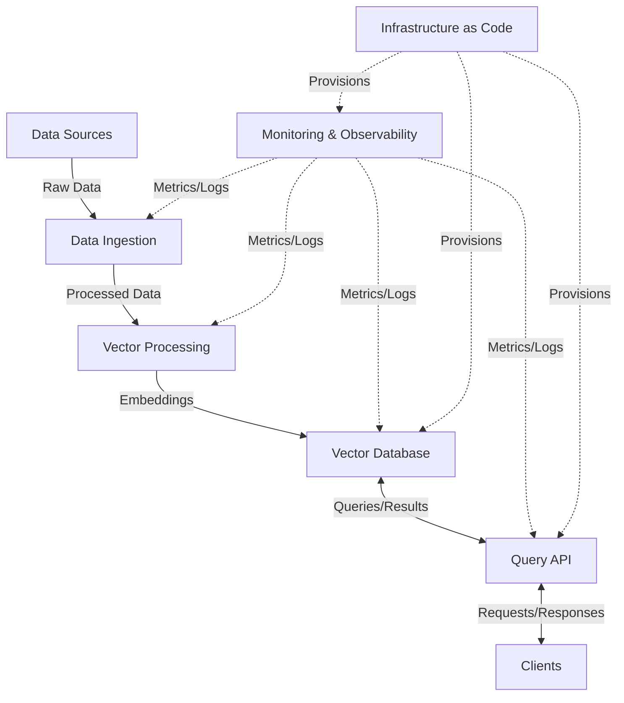

# System Patterns

This document outlines the system architecture, key technical decisions, design patterns in use, and component relationships.

## System Architecture

### Overview

The NYC Landmarks Vector DB consists of several interconnected components:

1. **Data Ingestion**: Processes landmark data from multiple sources (PDFs, APIs)
1. **Vector Processing**: Generates and manages vector embeddings
1. **Vector Database**: Stores and indexes vectorized landmark data
1. **Query API**: Provides endpoints for searching and retrieving landmark information
1. **Monitoring & Observability**: Tracks system health and performance

### Component Relationships



## Key Technical Decisions

### Vector Embedding Approach

1. **Chunking Strategy**:

   - Text is divided into semantically meaningful chunks
   - Optimal chunk size determined through experimentation
   - Overlap between chunks to maintain context

1. **Embedding Models**:

   - Using production-ready embedding models
   - Models selected for balance of accuracy and performance
   - Consistent embedding dimension across all document types

### Database Selection

1. **Pinecone as Vector Database**:

   - Selected for scalability and query performance
   - Supports high-dimensional vector storage
   - Provides similarity search capabilities
   - Offers metadata filtering

1. **Database Schema Design**:

   - Vectors stored with rich metadata
   - Standardized ID format for consistent reference
   - Efficient indexing for query performance

### API Design

1. **RESTful Principles**:

   - Clear resource-oriented endpoints
   - Consistent response formats
   - Proper status code usage

1. **Query Parameterization**:

   - Flexible filtering via metadata
   - Pagination support
   - Result limiting and sorting options

## Design Patterns

### Factory Pattern

Used in the creation of embeddings to abstract the embedding generation process:

```python
class EmbeddingFactory:
    @staticmethod
    def create_embedding(text, model_name):
        if model_name == "model_a":
            return ModelAEmbedding(text)
        elif model_name == "model_b":
            return ModelBEmbedding(text)
        # ...
```

### Repository Pattern

Used for data access abstraction, particularly for vector database operations:

```python
class VectorRepository:
    def __init__(self, client):
        self.client = client

    def query(self, vector, filters=None, top_k=10):
        # Implementation details hidden
        return results

    def upsert(self, vectors, metadata):
        # Implementation details hidden
        return status
```

### Strategy Pattern

Used for different text processing strategies:

```python
class TextProcessingStrategy:
    def process(self, text):
        """Process text according to strategy."""
        raise NotImplementedError


class LandmarkReportStrategy(TextProcessingStrategy):
    def process(self, text):
        # Specific implementation for landmark reports
        pass


class WikipediaArticleStrategy(TextProcessingStrategy):
    def process(self, text):
        # Specific implementation for Wikipedia articles
        pass
```

### Singleton Pattern

Used for database client connections to ensure single instances:

```python
class DatabaseClient:
    _instance = None

    @classmethod
    def get_instance(cls, config):
        if cls._instance is None:
            cls._instance = cls(config)
        return cls._instance
```

## Logging and Monitoring Patterns

### Structured Logging

All components use structured logging with consistent fields:

```python
logger.info(
    {
        "event": "vector_search",
        "query_id": query_id,
        "filters": filters,
        "results_count": len(results),
        "duration_ms": duration,
    }
)
```

### Metrics Collection

Standard metrics are collected across all components:

1. **Operational Metrics**:

   - Request counts
   - Error rates
   - Latency distributions

1. **Business Metrics**:

   - Query patterns
   - Data volume
   - Usage by endpoint

### Health Checks

All services implement standardized health check endpoints:

```
GET /health
Response: {"status": "healthy", "checks": {...}}
```

## Error Handling

### Consistent Error Responses

API errors follow a standardized format:

```json
{
  "error": {
    "code": "INVALID_PARAMETER",
    "message": "The parameter 'limit' must be a positive integer",
    "details": {...}
  }
}
```

### Graceful Degradation

System components are designed to degrade gracefully when dependencies fail:

1. **Caching**: Results are cached where appropriate to serve during outages
1. **Fallbacks**: Alternative data sources are used when primary sources fail
1. **Circuit Breaking**: Prevents cascading failures by stopping requests to failing services

## Infrastructure Management Patterns

### Infrastructure as Code

All infrastructure is defined using Terraform:

1. **Resource Definition**: Complete infrastructure defined in code
1. **Configuration**: Environment-specific configurations separated from resource definitions
1. **Modularity**: Common patterns extracted into reusable modules

### Terraform Cloud Integration

Remote state management and collaborative workflows through Terraform Cloud:

1. **Remote State**: State files stored securely in Terraform Cloud
1. **Workspace Organization**: Separate workspaces for different environments
1. **API-driven Configuration**: Workspace settings managed through the Terraform Cloud API
1. **Execution Consistency**: Operations executed in consistent Terraform Cloud environment
1. **Team Collaboration**: Shared access to infrastructure state and history

## Testing Patterns

### Unit Testing

Component tests focus on isolating functionality:

```python
def test_vector_similarity():
    vec1 = [0.1, 0.2, 0.3]
    vec2 = [0.15, 0.25, 0.35]
    similarity = calculate_similarity(vec1, vec2)
    assert 0.95 < similarity < 1.0
```

### Integration Testing

Tests verify component interactions:

```python
def test_embedding_storage_retrieval():
    # Test complete flow from embedding creation to storage and retrieval
    text = "Sample landmark description"
    embedding = create_embedding(text)
    store_result = store_embedding(embedding, {"text": text})
    retrieved = retrieve_similar(embedding)[0]
    assert retrieved["metadata"]["text"] == text
```

### Mock Testing

Tests use mocks for external dependencies:

```python
@mock.patch("pinecone.Index")
def test_vector_query(mock_index):
    # Configure mock
    mock_index.return_value.query.return_value = {"matches": [...]}

    # Test with mock
    repo = VectorRepository(mock_index)
    results = repo.query([0.1, 0.2, 0.3])
    assert len(results) > 0
```

## CI/CD Patterns

### Pipeline Stages

1. **Code Validation**: Linting, formatting, and static analysis
1. **Testing**: Unit, integration, and functional tests
1. **Build**: Package creation and containerization
1. **Deployment**: Infrastructure provisioning and application deployment
1. **Verification**: Post-deployment tests and health checks

### Quality Gates

Each stage must pass before proceeding to the next:

1. **Code Quality**: Enforced through pre-commit hooks and CI checks
1. **Test Coverage**: Minimum coverage thresholds enforced
1. **Security Scanning**: Vulnerability detection in code and dependencies
1. **Performance Verification**: Load testing for critical paths

Wikipedia content processing follows these patterns:

- **Modular Processing Pipeline**: Content flows through a series of specialized processing steps
- **Quality Assessment**: Articles are evaluated for quality using the Wikimedia Lift Wing API
- **Revision Tracking**: Article revision IDs are captured and propagated through the pipeline
- **Token-based Chunking**: Content is chunked based on token count rather than character count
- **Metadata Enrichment**: Each chunk is enriched with article metadata including quality ratings
- Article fetching by landmark name
- Content cleaning and normalization
- Integration with existing landmark vectors
