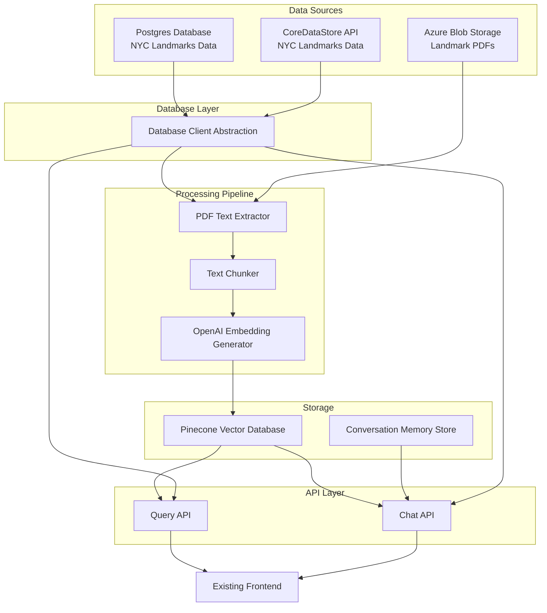

# NYC Landmarks Vector Database - System Patterns

## System Architecture

## Key Technical Decisions

### 1. Python as Primary Language
- We're using Python for this project due to its excellent support for natural language processing, PDF extraction, and machine learning.
- Python also has strong library support for interacting with OpenAI, Pinecone, and database systems.

### 2. Modular Architecture
- The system is designed with clear separation of concerns, allowing components to be developed, tested, and maintained independently.
- Each major function (PDF extraction, text processing, embedding generation, etc.) is isolated in its own module.

### 3. Text Processing and Chunking Strategy
- PDF text will be extracted using PyPDF2 or similar libraries.
- Text will be chunked into smaller segments (approximately 500-1000 tokens each) to optimize for OpenAI's embedding models and Pinecone storage.
- Chunks will have some overlap (around 10-20%) to maintain context across chunks.
- Each chunk will maintain metadata about its source landmark and position in the original document.

### 4. Embedding Strategy
- We'll use OpenAI's embedding models (initially text-embedding-3-small) to generate vector embeddings.
- The embedding dimension will be 1536 (for text-embedding-3-small) or 3072 (if we upgrade to text-embedding-3-large).
- Batch processing will be implemented to optimize API calls to OpenAI.

### 5. Vector Database Structure
- Pinecone will be our vector database due to its ease of use, performance, and free tier availability.
- Each vector will correspond to a chunk of text from a landmark PDF.
- Metadata will include:
  - Landmark ID
  - Chunk index/position
  - Source PDF name/ID
  - Date of embedding generation
  - Other relevant landmark metadata for filtering

### 6. Database Abstraction Strategy
- We've implemented a database abstraction layer that supports both direct PostgreSQL connections and the CoreDataStore REST API.
- A configuration toggle (COREDATASTORE_USE_API) determines which data source is used at runtime.
- The DbClient class provides a unified interface that abstracts away the differences between data sources.
- The CoreDataStore API client provides extended functionality beyond what's available in the PostgreSQL client.
- Error handling is implemented at both the client level and in the abstraction layer.

### 7. Credential Management
- All credentials (OpenAI API keys, Azure storage credentials, Postgres credentials, Pinecone API keys, CoreDataStore API keys) will be managed through Google Cloud Secret Store.
- A secure configuration manager will retrieve and provide credentials to the application components that need them.
- Development environments will support fallback to environment variables or local files.

### 8. Conversation Memory Implementation
- The chat system will maintain conversation history using a simple key-value store.
- Each conversation will have a unique ID.
- History will be used to provide context for follow-up questions.
- Conversation context will have a reasonable time limit before expiring.

### 9. API Design Patterns
- RESTful API design for the query endpoints.
- JSON for all request and response formats.
- Versioned API endpoints to support future changes.
- Rate limiting and authentication for production.

### 10. Error Handling and Logging
- Comprehensive error handling throughout the application.
- Structured logging with different levels (DEBUG, INFO, WARNING, ERROR).
- Monitoring for key metrics (API calls, response times, error rates).
- Alerts for critical failures.

### 11. Testing Strategy
- Unit tests for individual components.
- Integration tests for component interactions.
- End-to-end tests for critical user flows.
- Testing of vector search quality using sample queries.

### 12. CI/CD Implementation
- GitHub Actions for continuous integration and deployment.
- Automated testing on pull requests.
- Deployment pipeline with appropriate staging environments.
- Infrastructure as code for any cloud resources.

### 13. Design Patterns
- Repository pattern for database access, with concrete implementations for different data sources.
- Adapter pattern for the CoreDataStore API client to map API responses to our internal data structures.
- Strategy pattern for switching between database implementations at runtime.
- Factory pattern for creating service instances.
- Strategy pattern for different text processing approaches.
- Decorator pattern for adding cross-cutting concerns (logging, error handling).
