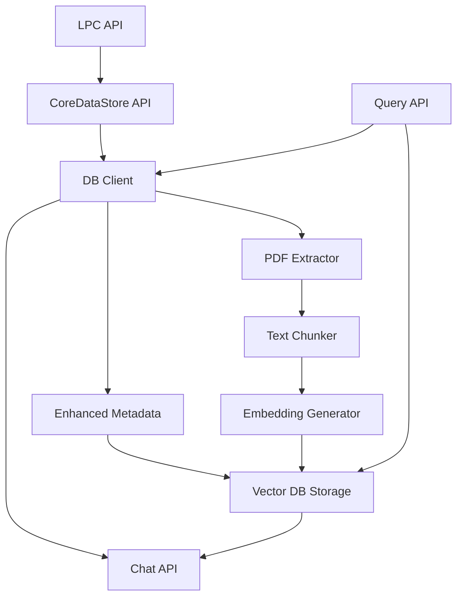

# System Patterns

## Architecture

The system follows a layered architecture with a clear separation of concerns:

1. Data access layer (API clients)
1. Domain model layer (domain/models with business logic)
1. Service layer (services providing business operations)
1. Presentation layer (API endpoints serving data to clients)

Key points:

- Clear dependency flow from outer to inner layers
- Dedicated model classes for resource representations
- Type annotations for static type checking
- Exception handling at service boundaries
- Metadata enrichment at the time of vector storage

## Data Flow



The system processes NYC landmarks data through these main steps:

1. **Data Acquisition**: Data is fetched from external sources:

   - CoreDataStore API as the main source for landmark metadata and reports
   - PDF reports are retrieved using unique landmark identifiers
   - Wikipedia articles may provide additional context

1. **Processing Pipeline**:

   - PDF reports are processed and chunked into segments
   - Each segment is embedded using OpenAI's embedding models
   - Embedding vectors are stored in Pinecone with metadata

1. **Query Interface**:

   - API endpoints allow searching across landmark content
   - Filters can be applied for specific metadata attributes
   - Vector similarity drives the search relevance

## Design Patterns

### Repository Pattern

The system uses repository pattern to abstract data access:

- `DbClient` provides standardized repository interface
- Specific fetching functions encapsulate data retrieval logic
- Strongly typed domain models represent external data
- Function-based access for specialized use cases

### Factory Pattern

Factory patterns create instances and provide flexibility:

- Factory functions for clients and collectors
- Environment-specific instantiation logic
- Configuration-driven creation processes

### Strategy Pattern

Storage and retrieval strategies provide interchangeable behaviors:

- Vector storage strategies (like Pinecone implementation)
- Embedding generation strategies (OpenAI, etc.)
- Configurable chunk sizing strategies

### Façade Pattern

Complex subsystems are hidden behind simple interfaces:

- `DbClient` provides unified interface for CoreDataStore API
- `PineconeDB` provides unified interface for vector operations
- Query API provides simplified access to vector search capabilities

## Testability

The codebase is designed for testability:

- Dependency injection for external services
- Interface-based design for mocking
- Clean separation between API clients and business logic
- Configuration-driven functionality for test environments
- Mock data structure follows production patterns

## Error Handling

Error handling follows these patterns:

- Detailed logging at appropriate severity levels
- Graceful degradation when services are unavailable
- Explicit exception handling with meaningful error messages
- Transaction-like approach for multi-step operations
- Retry logic for transient failures

## Centralized Mock Data

The test suite follows a pattern of centralizing mock data:

- `tests/mocks` directory serves as a central repository for mock data
- Mock data is provided via function calls with proper typing
- The shared mock data functions follow the naming convention `get_mock_*`
- Mock objects match the structure and type of real objects
- For Pydantic models, mocks return actual model instances rather than dictionaries
- Mocks contain all required fields plus commonly accessed optional fields

## API Integration

External API integration follows consistent patterns:

- Strongly typed representations of API responses
- Adapters for converting between API and domain models
- Flexible handling of both dictionary and object access patterns
- Consistent error handling and validation
- Case-insensitive handling for identifiers

## Configuration Management

Configuration is managed using:

- Environment variables for deployment-specific settings
- Settings module for application-wide configuration
- Feature flags for conditional functionality
- Strong typing for configuration values

## Metadata Collection

Enhanced metadata collection follows these patterns:

- Tiered approach starting with basic metadata
- Progressive enhancement with additional sources
- Direct property access instead of helper methods
- Graceful fallback when sources are unavailable
- Strong typing for metadata representation

## Flattened Complex Metadata

To handle complex, nested data structures within vector database metadata constraints:

- Structured arrays are flattened to key-value pairs using consistent naming conventions
- For example, building data is transformed from:
  ```
  "buildings": [
    {"name": "Building A", "address": "123 Main St"},
    {"name": "Building B", "address": "456 Elm St"}
  ]
  ```
  to:
  ```
  "building_0_name": "Building A",
  "building_0_address": "123 Main St",
  "building_1_name": "Building B",
  "building_1_address": "456 Elm St",
  "building_names": ["Building A", "Building B"]
  ```
- Array indices are incorporated into key names (`building_0_name`, `building_1_name`)
- Common search fields are preserved as arrays for filtering (e.g., `building_names` array)
- Transformation happens at collection time through specialized helper methods (e.g., `_flatten_buildings_metadata`)
- Original structured data is preserved internally for processing but flattened before storage
- String conversion ensures consistency with Pinecone metadata constraints (except for boolean values)

## Vector ID Standardization

Vector IDs follow a consistent pattern:

- Format: `LP-XXXXX-N` for all vector entries
- Landmark ID followed by chunk number
- Consistent formatting enforced at creation time
- Validation to ensure uniqueness and retrievability

## Text Processing

Text processing follows consistent approaches:

- Chunk size optimization based on token limits
- Semantic chunking to preserve context
- Overlap between chunks to maintain continuity
- Clean text representation with normalized spacing
- Source attribution for traceability

## Wikipedia Integration

Wikipedia content processing follows these patterns:

- Article fetching by landmark name
- Content cleaning and normalization
- Chunking based on semantic boundaries
- Integration with existing landmark vectors
- Source labeling for query filtering
