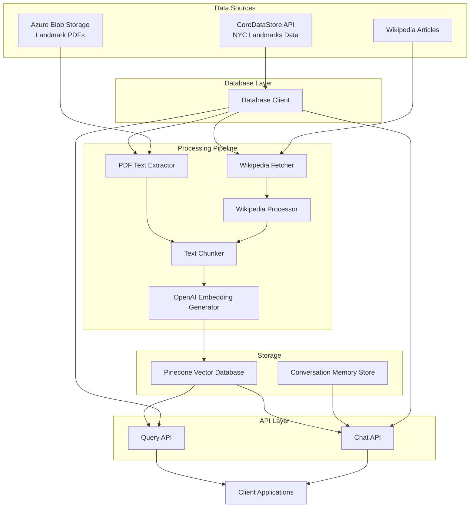

# NYC Landmarks Vector Database - System Patterns

## System Architecture



## Key Technical Decisions

### 1. Python as Primary Language

- We're using Python for this project due to its excellent support for natural language
  processing, PDF extraction, and machine learning.
- Python also has strong library support for interacting with OpenAI, Pinecone, and
  database systems.

### 2. Modular Architecture

- The system is designed with clear separation of concerns, allowing components to be
  developed, tested, and maintained independently.
- Each major function (PDF extraction, text processing, embedding generation, etc.) is
  isolated in its own module.

### 3. Text Processing and Chunking Strategy

- PDF text will be extracted using PyPDF2 or similar libraries.
- Text will be chunked into smaller segments (approximately 500-1000 tokens each) to
  optimize for OpenAI's embedding models and Pinecone storage.
- Chunks will have some overlap (around 10-20%) to maintain context across chunks.
- Each chunk will maintain metadata about its source landmark and position in the
  original document.

### 4. Embedding Strategy

- We'll use OpenAI's embedding models (initially text-embedding-3-small) to generate
  vector embeddings.
- The embedding dimension will be 1536 (for text-embedding-3-small) or 3072 (if we
  upgrade to text-embedding-3-large).
- Batch processing will be implemented to optimize API calls to OpenAI.

### 5. Vector Database Structure

- Pinecone will be our vector database due to its ease of use, performance, and free
  tier availability.
- Each vector corresponds to a chunk of text from either a landmark PDF or a Wikipedia
  article.
- Vector IDs follow a consistent deterministic format:
  - PDF vectors: `{landmark_id}-chunk-{chunk_index}` (e.g., `LP-00001-chunk-0`)
  - Wikipedia vectors: `wiki-{article_title}-{landmark_id}-chunk-{chunk_index}` (e.g.,
    `wiki-Wyckoff_House-LP-00001-chunk-0`)
- Metadata includes:
  - Landmark ID
  - Source type (pdf/wikipedia)
  - Chunk index/position
  - For PDFs: Source PDF name/ID
  - For Wikipedia: Article title and URL
  - Date of embedding generation
  - Other relevant landmark metadata for filtering

### 6. Database Access Strategy

- We're using the CoreDataStore REST API exclusively as our data source for NYC
  landmarks information.
- The DbClient class provides a unified interface that abstracts away the complexity of
  the API calls.
- The CoreDataStore API client provides extensive functionality including access to
  landmark data, buildings, photos, PLUTO data, etc.
- Error handling is implemented at the client level with appropriate logging and
  fallback mechanisms.
- An MCP server (coredatastore-swagger-mcp) wraps the CoreDataStore API, providing
  comprehensive tools for interacting with the API directly, including:
  - Access to landmark reports (GetLpcReport, GetLpcReports)
  - Building information (GetLandmarks, GetLandmarkStreets)
  - Photo archives (GetLpcPhotoArchive, GetLpcPhotoArchiveCount)
  - Property data (GetPlutoRecord)
  - Reference data (GetBoroughs, GetNeighborhoods, GetObjectTypes,
    GetArchitectureStyles)
  - Miscellaneous content (GetLpcContent)
- Integration testing infrastructure with mock implementations for testing without
  actual API dependencies
- Support for pagination when fetching large datasets across multiple API calls

### 7. Credential Management

- All credentials (OpenAI API keys, Azure storage credentials, Pinecone API keys,
  CoreDataStore API keys) will be managed through Google Cloud Secret Store.
- A secure configuration manager will retrieve and provide credentials to the
  application components that need them.
- Development environments will support fallback to environment variables or local
  files.

### 8. Conversation Memory Implementation

- The chat system will maintain conversation history using a simple key-value store.
- Each conversation will have a unique ID.
- History will be used to provide context for follow-up questions.
- Conversation context will have a reasonable time limit before expiring.

### 9. API Design Patterns

- RESTful API design for the query endpoints.
- JSON for all request and response formats.
- Versioned API endpoints to support future changes.
- Rate limiting and authentication for production.

### 10. Error Handling and Logging

- Comprehensive error handling throughout the application.
- Structured logging with different levels (DEBUG, INFO, WARNING, ERROR).
- Monitoring for key metrics (API calls, response times, error rates).
- Alerts for critical failures.

### 11. Testing Strategy

- Comprehensive testing approach covering multiple levels:
  - **Unit tests** for individual components using pytest
  - **Integration tests** for component interactions and API integrations
  - **MCP tests** specifically for CoreDataStore API interactions
  - **End-to-end tests** for critical user flows
- Mock objects and fixtures for isolated component testing
- Actual API integration tests for validation with real data
- Test organization with explicit markers (unit, integration, mcp)
- VS Code configuration for test discovery and execution
- CI/CD pipeline to automate testing on pull requests

### 12. Data Validation and Modeling

- Pydantic used throughout the application for data validation and modeling
- Models defined for:
  - API responses (LpcReportResponse, etc.)
  - Core data entities (LpcReportModel, PdfInfo, etc.)
  - Processing results (ProcessingResult, etc.)
  - Error handling (ApiError, etc.)
- Validation rules implemented within models (URL validation, etc.)
- Improved type safety through Pydantic's type annotations
- Better error messages through Pydantic's validation system

### 13. CI/CD Implementation

- **GitHub Actions** is used for continuous integration and deployment.
- **Testing Workflow:** Automated testing runs on pull requests to ensure code quality
  before merging. (Details TBD)
- **Landmark Processing Workflow (`.github/workflows/process_landmarks.yml`):**
  - **Trigger:** Manually triggered via `workflow_dispatch` with configurable inputs
    (`api_page_size`, `job_batch_size`, `parallel_workers`, `recreate_index`,
    `total_records`).
  - **Structure:** A two-job pipeline:
    1. `generate_batches`: Runs `scripts/generate_matrix.py` to calculate processing
       batches based on inputs and outputs a JSON matrix.
    1. `process`: Uses the generated matrix with a `fail-fast: false` strategy to run
       multiple parallel jobs. Each job processes a specific batch of landmark data
       pages (`start_page` to `end_page`).
  - **Execution:** Each `process` job checks out the code, sets up Python, installs
    system dependencies (`poppler-utils`, `tesseract-ocr`, etc.) and Python
    requirements, then executes `scripts/process_landmarks.py`.
  - **Parallelism:** Supports parallelism *within* each `process` job via the
    `parallel_workers` input, in addition to the parallelism *across* jobs provided by
    the matrix strategy.
  - **Credentials:** API keys (Pinecone, CoreDataStore, OpenAI) are securely passed as
    environment variables using GitHub secrets.
  - **Configuration:** Allows dynamic configuration of batch sizes and parallelism for
    scalability and efficiency.
  - **Timeout:** Jobs have an increased timeout (120 minutes) to accommodate potentially
    long processing times.

```mermaid
flowchart TD
    A[Manual Trigger (workflow_dispatch)\nInputs: page_size, batch_size, workers, recreate_index, total_records] --> B(generate_batches Job);
    B --> C{Run generate_matrix.py};
    C --> D[Output: Processing Matrix (JSON)];
    D --> E(process Job - Matrix Strategy);
    subgraph E [process Job (Runs for each matrix entry)]
        F[Setup Python & Install Dependencies (System & Python)] --> G{Run process_landmarks.py};
        G --> H[Args: start/end_page, page_size, workers, recreate_index?];
        I[Secrets: API Keys via Env Vars] --> G;
    end
```

- **Deployment Pipeline:** Details for deploying the API or other components are TBD.
- **Infrastructure as Code:** Any cloud resources required will ideally be managed using
  IaC tools (e.g., Terraform).

### 14. Design Patterns

- Repository pattern for database access via the CoreDataStore API.
- Adapter pattern for the CoreDataStore API client to map API responses to our internal
  data structures.
- Factory pattern for creating service instances.
- Strategy pattern for different text processing approaches.
- Decorator pattern for adding cross-cutting concerns (logging, error handling).
- Facade pattern to simplify interactions with complex external services.
