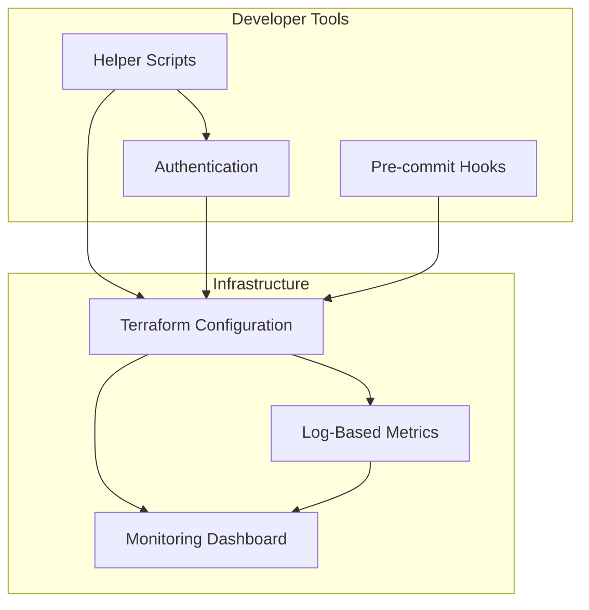

# Terraform Monitoring Implementation

This document describes the Terraform-based infrastructure management approach for monitoring that was introduced in PR #158.

## Overview

PR #158 introduced comprehensive Terraform support for managing the monitoring infrastructure of the NYC Landmarks Vector DB project, replacing the previous shell script-based approach with a more robust, version-controlled solution that uses infrastructure-as-code principles.

## Architecture

The Terraform implementation follows a modular architecture:



## Components

### Terraform Configuration Files

- **main.tf**: Defines the core infrastructure resources including:

  - Google Cloud provider configuration
  - Log-based metrics for requests, errors, latency, and validation warnings
  - Monitoring dashboard resource that visualizes these metrics

- **variables.tf**: Defines input variables for:

  - GCP project ID
  - Credentials file path
  - Region
  - Log name prefix

- **outputs.tf**: Defines output variables including:

  - Project ID
  - Region
  - Log metrics details
  - Dashboard ID and name

- **dashboard.json.tpl**: Template file for the monitoring dashboard with:

  - Widgets for request count, rate, errors, latency, and validation warnings
  - Configuration for visualization types (bar charts, line charts, scorecards)
  - Layout and formatting settings

### Helper Scripts

- **setup_terraform.sh**: First-time setup script that:

  - Validates prerequisites and environment
  - Initializes Terraform workspace
  - Creates configuration from templates
  - Detects GCP project ID from service account
  - Creates initial deployment plan

- **deploy_dashboard.sh**: Deployment script with commands for:

  - `plan`: Show planned changes
  - `apply`: Deploy resources
  - `destroy`: Remove resources
  - `output`: Show resource information
  - `status`: Show current state

- **health_check.sh**: Comprehensive validation script that:

  - Checks for required files
  - Validates script permissions
  - Verifies Terraform installation
  - Checks service account key validity
  - Validates Terraform configuration
  - Reports on system readiness

### Pre-commit Hooks

Added Terraform-specific hooks to `.pre-commit-config.yaml`:

- **terraform_fmt**: Automatically formats Terraform files to a canonical format
- **terraform_validate**: Validates Terraform configuration syntax and consistency

### TFLint Configuration

Added `.tflint.hcl` with rules for:

- Terraform best practices
- Google Cloud specific validations
- Naming conventions
- Documentation requirements

## DevContainer Integration

Enhanced the development environment with:

- **Terraform CLI**: Automatically installed via `ghcr.io/devcontainers/features/terraform:1`
- **HashiCorp Terraform VS Code Extension**: Added to the default extensions
- **Terraform-specific VS Code settings**:
  - Format on save for Terraform files
  - Experimental features for validation and auto-completion
  - Consistent formatting rules

## Resources Created

The Terraform configuration creates:

### Log-Based Metrics

1. **{log_name_prefix}.requests**: Tracks total API requests

   - Filter: Cloud Run revision logs with performance metrics

1. **{log_name_prefix}.errors**: Tracks HTTP 5xx errors

   - Filter: Performance logs with status_code >= 500

1. **{log_name_prefix}.latency**: Tracks request duration

   - Filter: Performance logs with duration_ms >= 0

1. **{log_name_prefix}.validation_warnings**: Tracks validation issues

   - Filter: WARNING level logs from validation module

### Monitoring Dashboard

The dashboard includes widgets for:

- **Total Request Count**: Bar chart showing request volume
- **Average Latency**: Scorecard with mean response time
- **Request Rate**: Line chart of requests per second
- **Error Rate**: Line chart of 5xx errors per second
- **Request Latency**: Combined view of average and 95th percentile latency
- **Validation Warning Rate**: Line chart of validation warnings per second

## Implementation Benefits

1. **Version Control**: Infrastructure configuration now stored in version control
1. **Repeatability**: Easy to reproduce the same infrastructure in different environments
1. **Validation**: Pre-commit hooks ensure consistent formatting and valid configuration
1. **Documentation**: Comprehensive documentation of infrastructure components
1. **DevOps Integration**: Easier integration with CI/CD pipelines
1. **Simplified Deployment**: Helper scripts streamline the deployment process

## Documentation

- **docs/terraform_monitoring_setup.md**: Comprehensive guide for setup and usage
- **docs/terraform_precommit_validation.md**: Detailed explanation of pre-commit hooks
- **infrastructure/README.md**: Overview of infrastructure management
- **infrastructure/QUICK_REFERENCE.md**: Quick reference for common commands
- **infrastructure/TERRAFORM_DEVCONTAINER.md**: Guide for using Terraform in devcontainer

## Future Enhancements

1. **Additional Metrics**: Add metrics for Wikipedia processing and vector database operations
1. **Alerting**: Configure alerting based on metric thresholds
1. **CI/CD Integration**: Automate infrastructure deployment through CI/CD pipeline
1. **Modularization**: Refactor into Terraform modules for better reusability
1. **Cost Monitoring**: Add resources for tracking and optimizing cloud costs

## Migration Path

The PR marks the shell-script approach as deprecated with a notice:

```bash
# DEPRECATED: Use Terraform in infrastructure/terraform instead.
echo "This script is deprecated. Please use Terraform in infrastructure/terraform instead." && exit 0
```

This allows for a smooth transition period where both approaches remain available, but users are directed toward the new Terraform-based solution.

## Required Permissions

For GCP service account:

- `roles/logging.configWriter`
- `roles/monitoring.editor`
- `roles/monitoring.metricWriter`

## Security Considerations

- Service account key never committed to version control
- Terraform state files properly gitignored
- Minimal required permissions for service account
- Documentation recommends using Workload Identity for production

## Advantages Over Previous Approach

| Feature               | Previous Script-Based Approach | New Terraform Approach |
| --------------------- | ------------------------------ | ---------------------- |
| Version Control       | Manual tracking                | Built-in with Git      |
| Validation            | None                           | Pre-commit hooks       |
| Idempotency           | Limited                        | Built-in               |
| State Management      | None                           | Terraform state        |
| Rollback              | Manual                         | `terraform destroy`    |
| Documentation         | Limited                        | Comprehensive          |
| IDE Integration       | None                           | VS Code extension      |
| Visualization         | None                           | Dashboard preview      |
| Authentication        | Manual setup                   | Automatic detection    |
| Dependency Management | Manual                         | Built-in               |
