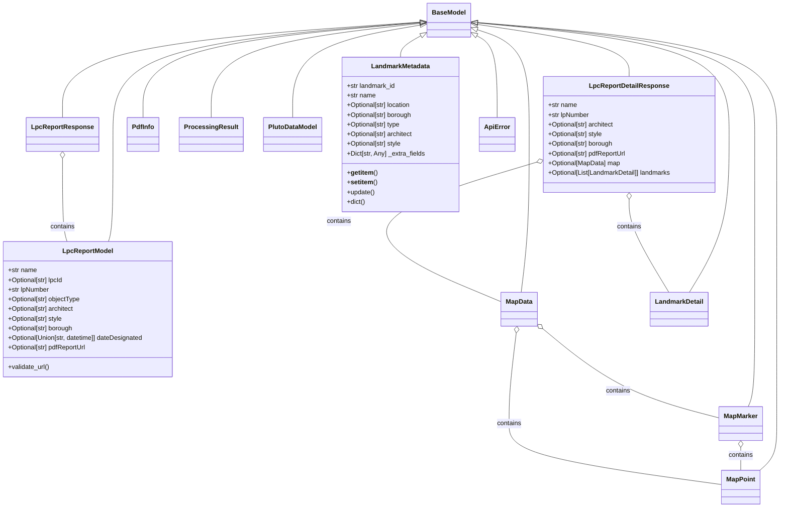
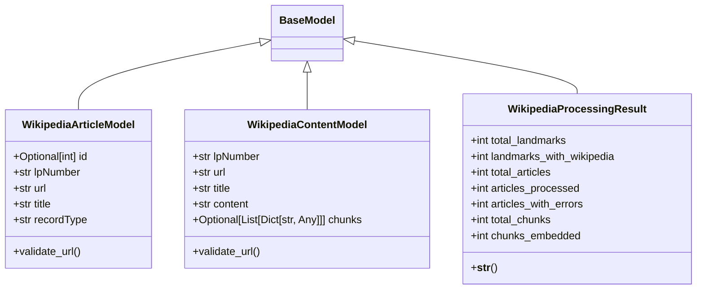
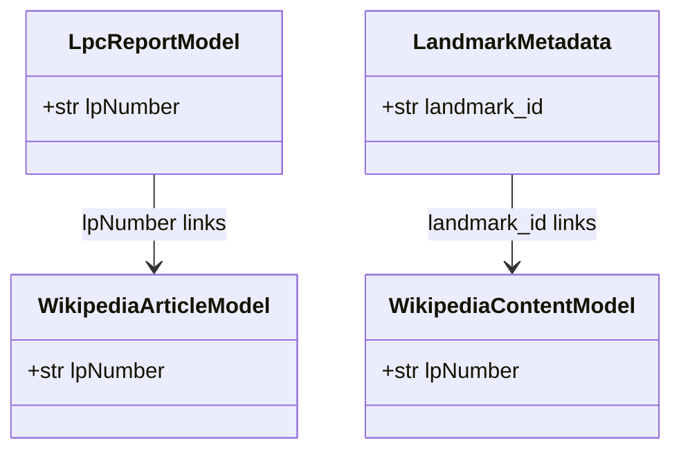

# NYC Landmarks Models

This directory contains Pydantic models that represent the core data structures used throughout the NYC Landmarks Vector Database project.

## Overview

The models in this directory define the structure and validation rules for:
- Landmark Preservation Commission (LPC) reports and their metadata
- Wikipedia articles associated with landmarks
- Processing results and statistics
- Vector database metadata

These models ensure type safety, consistent data validation, and standardized access patterns across the application.

## Model Hierarchy & Relationships

### Landmark Models Hierarchy



### Wikipedia Models



### Cross-Model Relationships



## Model Descriptions

### Landmark Models (`landmark_models.py`)

#### LpcReportModel
Represents a basic Landmark Preservation Commission (LPC) report with essential information about a landmark. Contains identifier, name, architectural details, and URL to the PDF report.

#### LpcReportResponse
Container model for paginated responses from the LPC Report API. Contains a list of `LpcReportModel` instances along with pagination metadata.

#### MapPoint, MapMarker, MapData
Hierarchical models for representing geographic location data:
- `MapPoint`: Simple latitude/longitude coordinates
- `MapMarker`: A point on a map
- `MapData`: Complete map information including zoom level, map type, center point, and markers

#### LandmarkDetail
Detailed information about a specific landmark building, including identifiers, addressing information, designation dates, and status.

#### LpcReportDetailResponse
Comprehensive model for a detailed landmark report, including architectural information, map data, and associated buildings or structures.

#### PdfInfo
Minimal model containing essential information needed to identify and access a PDF document for a specific landmark.

#### ProcessingResult
Statistics from landmark report processing operations, tracking the total number of reports processed and success rates.

#### PlutoDataModel
PLUTO (Primary Land Use Tax Lot Output) data for a landmark from NYC Department of City Planning, including year built, land use category, and zoning information.

#### LandmarkMetadata
Standardized metadata structure used for vector database storage. Supports dictionary-like access patterns for backward compatibility with existing code expecting dictionaries.

#### ApiError
Standardized error response model for API errors.

### Wikipedia Models (`wikipedia_models.py`)

#### WikipediaArticleModel
Represents a Wikipedia article associated with a landmark, including article ID, URL, title, and the associated landmark ID (`lpNumber`).

#### WikipediaContentModel
Stores the content of a Wikipedia article, including both raw content and processed chunks ready for embedding.

#### WikipediaProcessingResult
Statistics from Wikipedia article processing operations, tracking totals and success rates of processing articles and generating embeddings.

## Usage Patterns

### Data Validation
All models leverage Pydantic's validation capabilities to ensure data integrity:
```python
# URL validation example
@field_validator("pdfReportUrl", "photoUrl", mode="after")
@classmethod
def validate_url(cls, v: Optional[str]) -> Optional[str]:
    if v is not None and not v.startswith(("http://", "https://")):
        raise ValueError("URL must be a valid HTTP or HTTPS URL")
    return v
```

### Dictionary-Like Access
The `LandmarkMetadata` model supports dictionary-like access and mutation:
```python
# Access metadata like a dictionary
metadata = LandmarkMetadata(landmark_id="LP-12345", name="Empire State Building")
landmark_id = metadata["landmark_id"]  # "LP-12345"

# Update values
metadata["architect"] = "Shreve, Lamb & Harmon"

# Use .get() with default values
style = metadata.get("style", "Unknown")
```

### Tracking Processing Statistics
Both `ProcessingResult` and `WikipediaProcessingResult` models provide a consistent interface for tracking and reporting on batch processing operations:
```python
result = ProcessingResult(total_reports=100, reports_with_pdfs=80)
print(result)  # "Total reports: 100, Reports with PDFs: 80"
```

## Key Integration Points

1. The `lpNumber` field serves as the primary key across multiple models, linking LPC reports, Wikipedia articles, and vector database entries.

2. The `LandmarkMetadata` model standardizes metadata for vector database storage while maintaining compatibility with dictionary-based access patterns.

3. Processing result models (`ProcessingResult` and `WikipediaProcessingResult`) provide consistent interfaces for tracking and reporting on batch operations.
